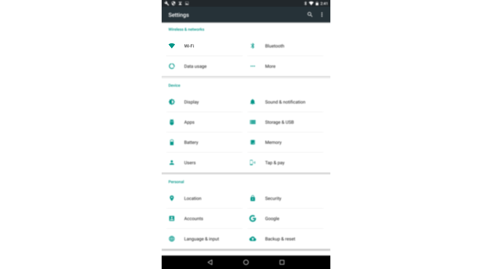
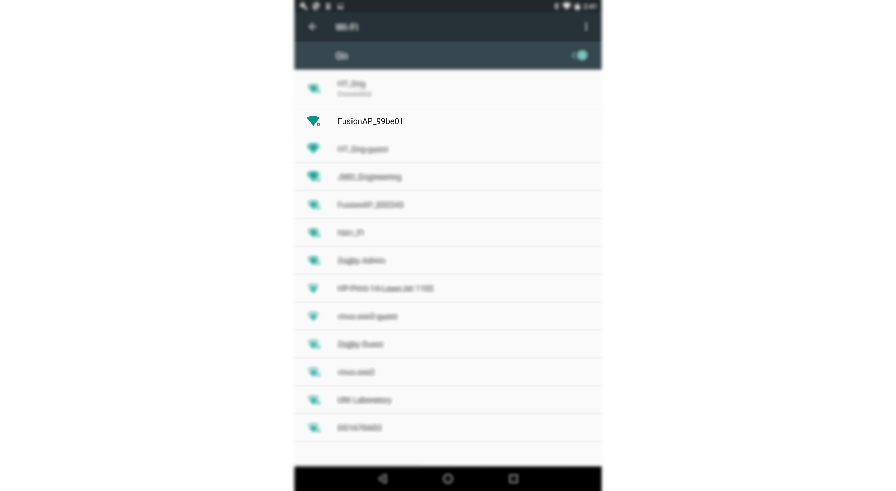
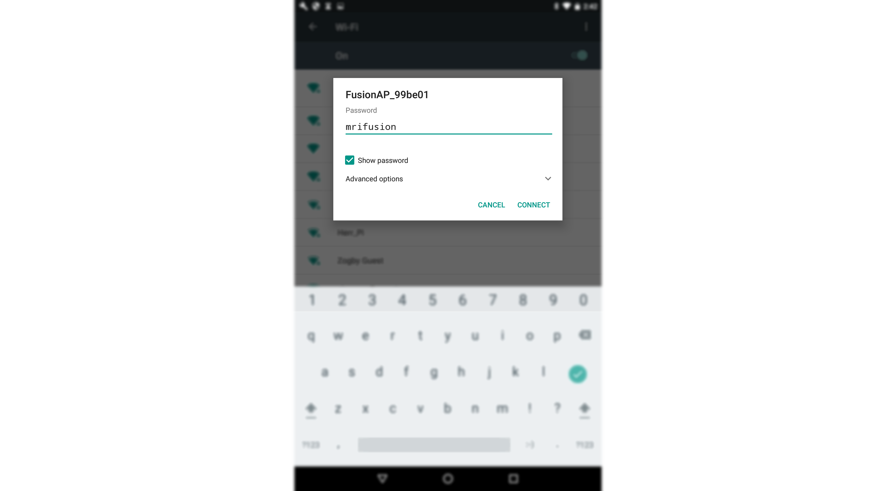
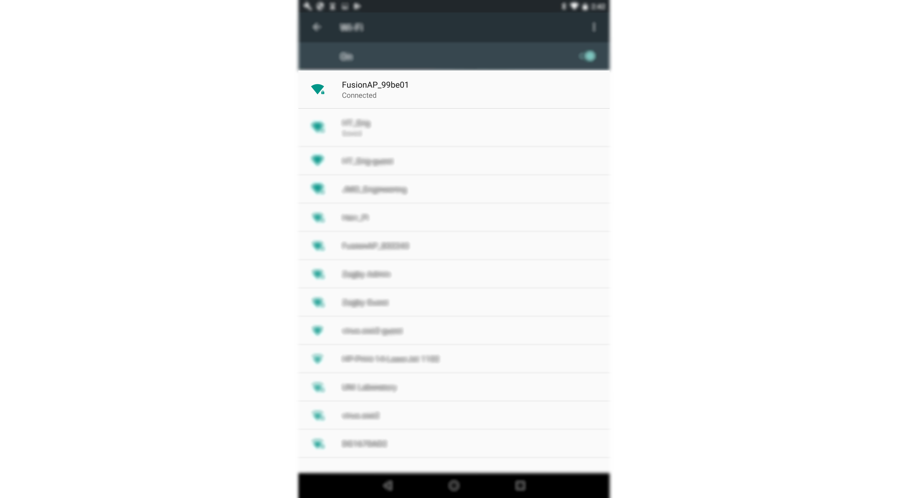

# **Connect to Fusion via Android**
-----
## **Steps to connect with Android**
>**1.** Find and open the Settings App on your Android device.  

>**2.** Once the settings menu is open, select Wi-Fi.

>**3.** Find the Fusion Access Point SSID and select it to enter the passkey(i.e. **FusionAP_99be01**).

>**4.** Enter the passkey for your Fusion. Then select "Connect" to connect.  
>Default Passkey: **mrifusion**

>**5.** Your Fusion is now connected to your Android device.

## **Questions?**
>Contact Boxlight Robotics at [support@BoxlightRobotics.com](mailto:support@BoxlightRobotics.com) with a detailed description of the steps you have taken and observations you have made.
>
>**Email Subject**: Connect Fusion via Android