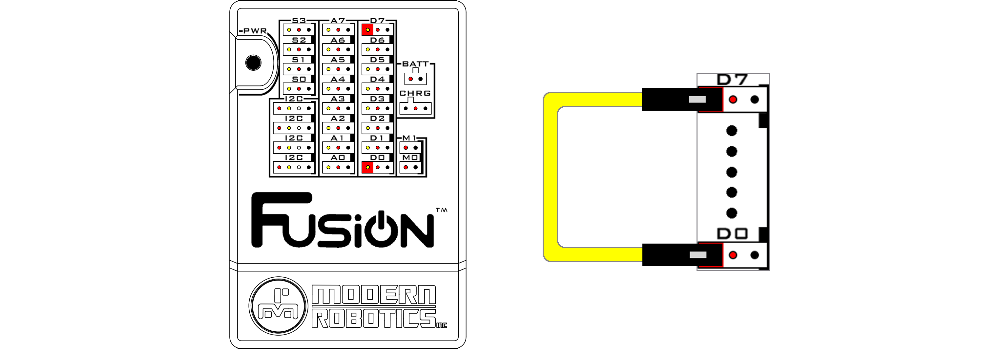
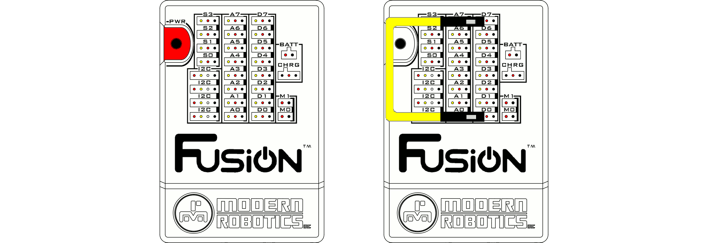
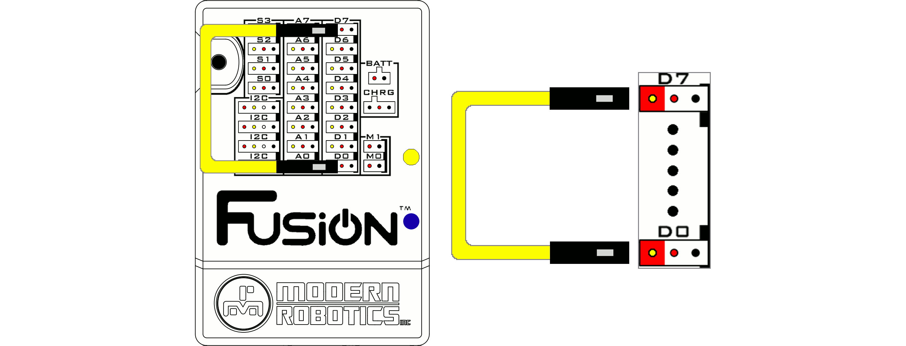

# **Restore Fusion Access Point SSID and Passkey**
-----
There are two methods for resetting the Fusion Access Point SSID and Passkey. Follow the steps below if you are unable to connect to your Fusion Access Point or want to reset the Fusion Access Point SSID and Passkey. 
## **Restore SSID and Passkey via the Web Interface**
>**1.** Open the Fusion settings from the hamburger menu on the left or the settings box on the home page.

>**2.** Navigate to the **WIRELESS** menu.

>**3.** In the **Access Point Settings** section, click the **DEFAULT** button to your restore the Fusion Access Point SSID and Passkey. 

>**4.**You will be prompted to restore the Access Point credentials to defualt. Clicking **OK** will restart your Fusion.

>**6.** The Fusion server will shutdown and you will need to reconnect with the original credentials once the Fusion restarts. This can be found on a sticker at the bottom of your Fusion Controller.

>For instructions on connecting to the Fusion Access Point, refer to the following links.

>* [Connect via Windows](AP_Windows.md)  
>* [Connect via Mac](AP_Mac.md)
>* [Connect via Linux](AP_Linux.md)  
>* [Connect via iOS](AP_iOS.md)  
>* [Connect via Android](AP_Android.md)

## **Restore SSID and Passkey via the System Recovery Wire**
If you are unable to connect to the Fusion Access Point or forgot your password, you will need to complete a hardware reset using the [System Recovery Wire](img/Web/WiFiSettings/System_Restore_Wire.png) included with your Fusion (color may vary).

>**1.** [Power off](Power_Off.md) the Fusion

>**2.** Connect the System Recovery Wire to left most pin (I/O Pin) of **D0** to the same pin on **D7**.

>**3.** [Power on](Power_On.md) the Fusion. The Status LED will start to blink.

>**4.** When the blue and yellow LEDs on the side of the Fusion turn on, the System Recovery Wire must be removed.

>**5.** The Fusion will continue to [power on](Power_On.md) as it normally would and will now have the default SSID and Passkey.

Follow the steps to [connect your Fusion](AP_Find.md) using the default credentials.

## **Questions?**
>Contact Boxlight Robotics at [support@BoxlightRobotics.com](mailto:support@BoxlightRobotics.com) with a detailed description of the steps you have taken and observations you have made.
>
>**Email Subject**: Restore Fusion Access Point 