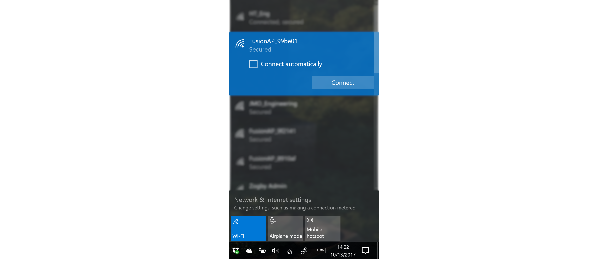
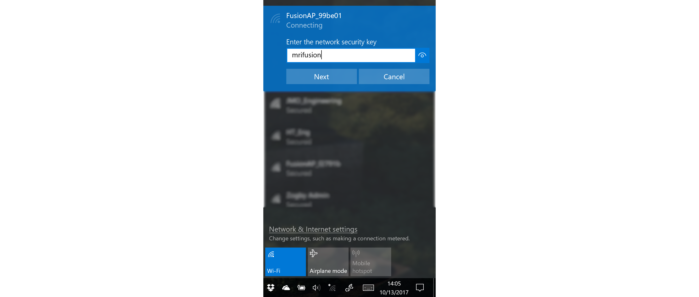
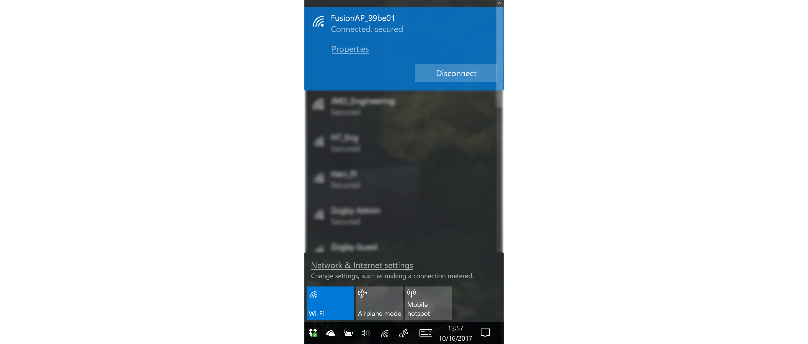

# **Connect to Fusion via Windows**
-----
## **Steps to connect with Windows**
>**1.** Turn on your computer's Wi-Fi capabilities. Click on the Wi-Fi symbol in the toolbar in the lower right hand corner.
>

>**2.** Find the Fusion Access Point SSID and select "Connect" to enter the passkey (i.e. **FusionAP_99be01**).

>**3.** Enter the passkey for your Fusion. Then click "Next" to connect.  
>Default Passkey: **mrifusion**

>**4.** Your Fusion is now connected to your Windows computer.

## **Questions?**
>Contact Boxlight Robotics at [support@BoxlightRobotics.com](mailto:support@BoxlightRobotics.com) with a detailed description of the steps you have taken and observations you have made.
>
>**Email Subject**: Connect Fusion via Windows