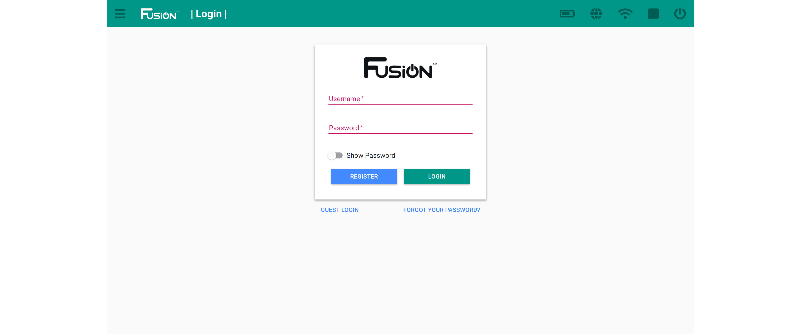

# **Accessing the Fusion Web Interface**
-----
We recommend using Google Chrome for the Fusion Web Interface.

## **Connecting to the Fusion Web Interface**
>**1.** Open your browser (**Google Chrome**) and click on the address bar on top.

>**2.** Type **my.bot** into the address bar of your browser. To connect using an IP address, type 192.168.50.1:8080 into the address bar.

>**3.** Click "Go To" or press your Enter key on your keyboard to go to that address.

>You should now be connected to the Fusion Web Interface by being presented with the login screen.

>Now you can either login with as the guest or an existing account previously created.  
>If you do not have an account, follow the steps to [create an accont](Account_Create.md).

## **Error "This site can't be reached"**
>If you are having trouble accessing the Fusion Web Interface follow the steps below.  
>>**1.** Make sure you are connected to the [Fusion Access Point](AP_Find.md) and try again. 

>>**2.** If that does not work, try restarting the Fusion by [powering off](Power_Off.md) and [powering on](Power_On.md).

## **Questions?**
>Contact Boxlight Robotics at [support@BoxlightRobotics.com](mailto:support@BoxlightRobotics.com) with a detailed description of the steps you have taken and observations you have made.
>
>**Email Subject**: Accesing Fusion Web Interface