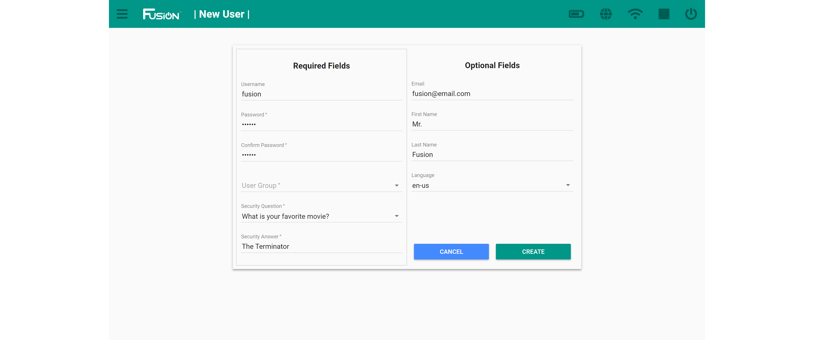
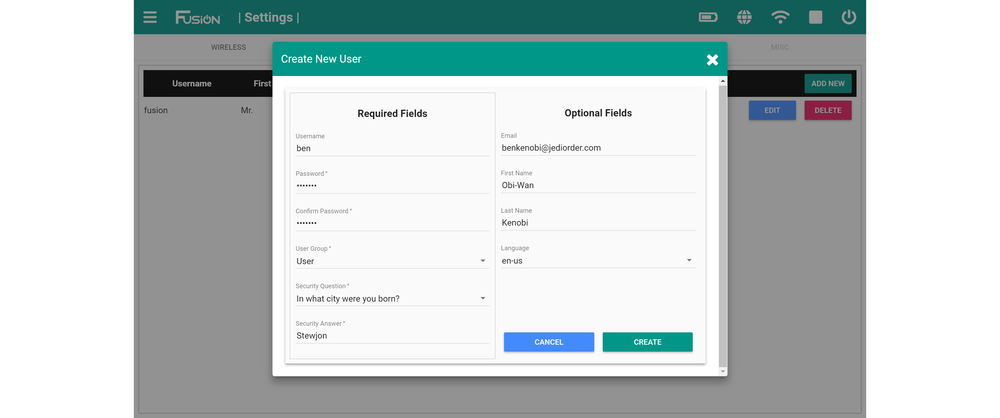

# **Create an Account**
-----
## **Create an account from the login screen**
>**1.** When presented with the login screen, click **REGISTER** to start the registration process.

>**2.** Enter your information into the registration form. Fields marked with a * are required while the other fields may be left blank. In the *User Group*, you can select from **Admin** or **User**.  
>
>If this is your first time creating an account, we recommend making an administrator account. Only 1 administrator account can be created from the login screen. Additional administrator accounts can be created from the [User Settings](Account_Create.md#create-an-account-from-the-user-settings-screen)  

>Click **Register** once you have completed the form. You will then be directed to the Fusion Web Interface home screen.

## **Create an account from the user settings screen**
>You must be logged into an administrator account to create additional users from the settings.

>**1.** Open the Fusion settings from the hamburger menu on the left or the settings box on the home page.

>**2.** Navigate to the **USERS** menu.  

>**3.** Select the **ADD NEW** button to add a new user.

>**4.** Enter your information into the registration form. Fields marked with a * are required while the other fields may be left blank. In the *User Group*, you can select from **Admin** or **User**.

>Click **CREATE** once you have completed the form. 

## **Questions?**
>Contact Boxlight Robotics at [support@BoxlightRobotics.com](mailto:support@BoxlightRobotics.com) with a detailed description of the steps you have taken and observations you have made.
>
>**Email Subject**: Creating a Fusion Account