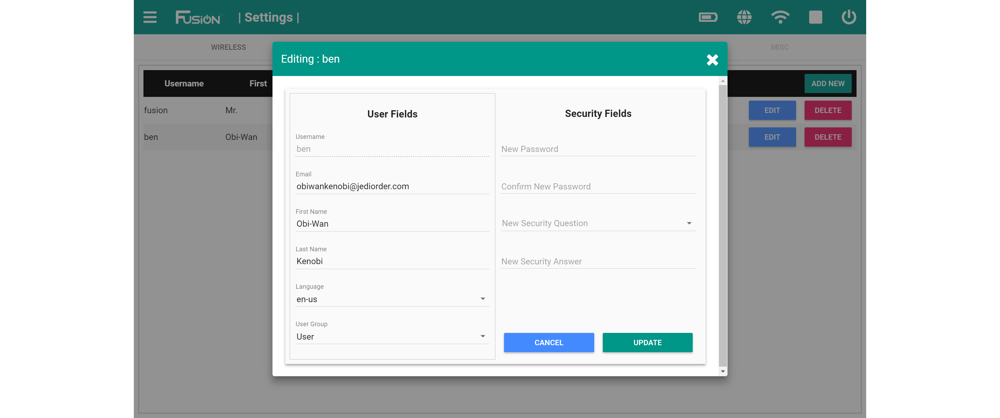

# **Edit an Account**
-----
## Edit an account from the user settings screen
>You must be logged into an administrator account to edit a current user account.

>**1.** Open the Fusion settings from the hamburger menu on the left or the settings box on the home page.

>**2.** Navigate to the **USERS** menu.

>**3.** Select the blue **EDIT** button to add a new user.

>**4.** Modify the information in the registration form. Fields marked with a * are required while the other fields may be left blank.

>Click **UPDATE** once you are done updating the form. 

## **Questions?**
>Contact Boxlight Robotics at [support@BoxlightRobotics.com](mailto:support@BoxlightRobotics.com) with a detailed description of the steps you have taken and observations you have made.
>
>**Email Subject**: Editing a Fusion Account