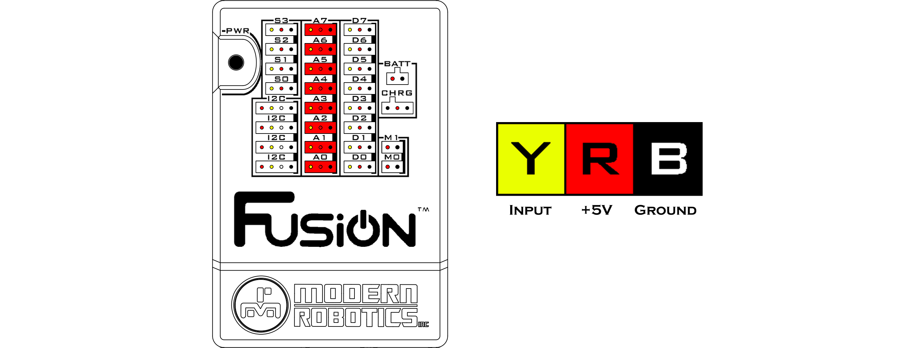

# **Analog Ports**
-----
There are 8 analog ports for reading analog sensors that range from **0** - **1023**. Eacch port consists of a black, red and yellow wire connection. The black wire is the ground wire and must line up with the black bar on the right side of the port. The red wire is the power wire that connects to 5V for all the sensors to operate on. The yellow wire is the variable voltage line that ranges from 0V-5V and it is used to receive a signal from the sensor.
   
>**Signal Logic Levels** : Analog 0V - 5V  
>**Resolution** : 10 bit  
>**Ports** : A0 - A7  
>[Blockly Programming Reference](Blk_Analog_Digital.md#analog-read)   
>[Python Programming Reference](Py_Driver.md#analogread-port)

## **Questions?**
>Contact Boxlight Robotics at [support@BoxlightRobotics.com](mailto:support@BoxlightRobotics.com) with a detailed description of the steps you have taken and observations you have made.
>
>**Email Subject**: Fusion Analog Ports