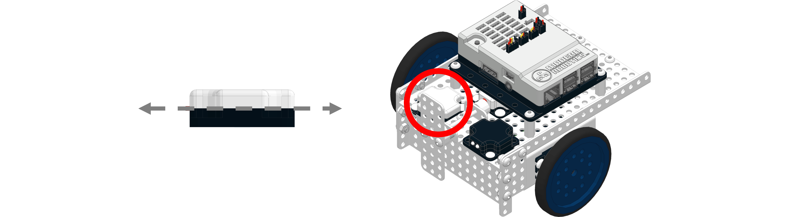

# **Basic Fusion Control**
-----
The Basic Fusion Control toolbox comes with the necessary Start, LED and Wait blocks.

**List of available blocks:**  

* [**Start Block**](Basic_Fusion-Control.md#start-block)
* [**Drive With Gyro**](Basic_Fusion-Control.md#drive-with-gyro)
* [**Blue LED ON**](Basic_Fusion-Control.md#blue-led-on)
* [**Yellow LED ON**](Basic_Fusion-Control.md#yellow-led-on)
* [**Both LEDs ON**](Basic_Fusion-Control.md#both-leds-on)
* [**Both LEDs OFF**](Basic_Fusion-Control.md#both-leds-off)
* [**Wait**](Basic_Fusion-Control.md#wait)

## **Start Block**
>Initializes the Fusion Robot at the start of every program. This block must be used in every Blockly program. By default the Start block is included in the programming environment. 
>
>### Block:
>
>

## **Drive With Gyro**
>This block enables the robot to move using the Boxlight Robotics [Integrating Gyro](img/Sensor_Diagrams/IntGyro.png) for percise turning. When used in a program, the basic [Move](Basic_Move-Robot.md) and [Rotate](Basic_Rotate-Robot.md) blocks become modified.  

>### Block:
>
>
>
>The Integrating Gyro can be placed anywhere on the robot, but it must lay flat and oriented right-side up.
>
>
>

## **Blue LED ON**
>Turn on the Blue LED. Turn off the Yellow LED.
>
>### Block:
>
>

## **Yellow LED ON**
>Turn on the Yellow LED. Turn off the Blue LED.
>
>### Block:
>
>

## **Both LEDs ON**
>Turn on the Yellow and Blue LEDs.
>
>### Block:
>
>

## **Both LEDs OFF**
>Turn off the Yellow and Blue LEDs.
>
>### Block:
>
>

## **Wait**
>Wait 1 Second.
>
>### Block:
>
>

## **Questions?**
>Contact Boxlight Robotics at [support@BoxlightRobotics.com](mailto:support@BoxlightRobotics.com) with a detailed description of the steps you have taken and observations you have made.
>
>**Email Subject**: Basic Fusion Control