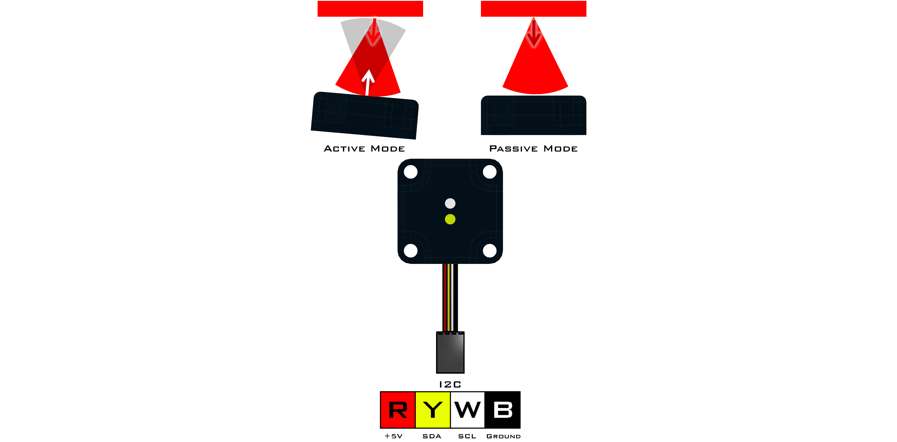
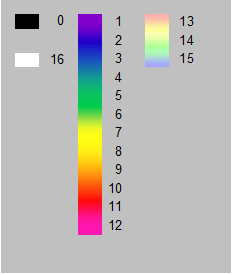

# **Color Sensor (45-2018)**
-----
The Color Sensor is used to detect the color of an object or a visible light source. Along with raw and adjusted RGB values, the device can also return a color number corresponding to a the colors listed below in the documentation. Calibration steps must be taken as needed based on the environment and ambient lighting for the most accurate readings. Maximum detection distance of the color sensor is approximately 7cm and it is recommended that during active mode the device is placed at a slight angle to avoid white light reflecting from the LED. 

* Connect via **I2C** port.

>[Color Sensor Python Library Information](Py_Color_Sensor.md)  

**List of available blocks:**  

* [**Set Mode**](Blk_Color_Sensor.md#set-mode)
* [**Get Color Number**](Blk_Color_Sensor.md#get-color-number)
* [**Get RGB**](Blk_Color_Sensor.md#get-rgb)

## **Set Mode**
>Set the reading mode and frequency. Values are saved within the sensor memory, therefore this block only needs to be called when the mode needs to be changed.
>
>* Mode:
    * **Active** (Default)
    * **Passive**
>* Frequency:
    * **60 Hz** (Default)
    * **50 Hz**
    
>### Block:
>
>
>
>### Code Produced:
>
>>Setup:
>>>
    colour = Fusion.color(f)

>>Code:
>>>
    colour.colorSetup(colour.ACTIVE, colour.SIXTY_HZ)

## **Get Color Number**
>Returns a value representing a color based on the color chart below.
>
>
>    
>### Block:
>
>
>
>### Code Produced:
>
>>Setup:
>>>
    colour = Fusion.color(f)

>>Code:
>>>
    colour.getColorNumber()
    
>### Example:
>
>
>
>>Code:
>>>
    import Fusion
    f = Fusion.driver()
    my_color = None
    colour = Fusion.color(f)
    my_color = colour.getColorNumber()

## **Get RGB**
>Returns the **Red**, **Green** or **Blue** reading from the current object in front of the sensor.
>
>* Can read the **Red**, **Green** or **Blue** value.
>* The returned ranges from **0** to **255**.
>    
>### Block:
>
>
>
>### Code Produced:
>
>>Setup:
>>>
    colour = Fusion.color(f)

>>Code:
>>>    
    colour.getRGBIndex()[0]
    
>### Example:
>
>
>
>>Code:
>>>
    import Fusion
    f = Fusion.driver()
    my_red = None
    my_green = None
    my_blue = None
    colour = Fusion.color(f)
    my_red = colour.getRGBIndex()[0]
    my_green = colour.getRGBIndex()[1]
    my_blue = colour.getRGBIndex()[2]

## **Questions?**
>Contact Boxlight Robotics at [support@BoxlightRobotics.com](mailto:support@BoxlightRobotics.com) with a detailed description of the steps you have taken and observations you have made.
>
>**Email Subject**: Fusion Blockly Color Sensor