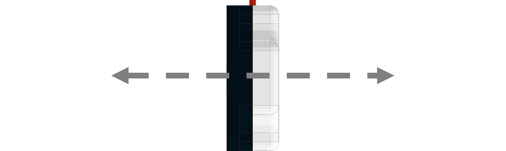

# **Compass (45-2003)**
-----
The Compass uses a magnetometer and an accelerometer to calculate heading data based on Earth’s magnetic field. The compass can return the heading data, accelerometer data and magnetometer data to the user. Anything that generates a magnetic field must be moved away from the sensor like power cables, motor or magnetic material. This must happen because during calibration the sensor will add an offset to account for other magnetic sources in the area.

* Connect via any **I2C** port.

>[Compass Python Library Information](Py_Compass.md)  

**List of available blocks:**  

* [**Get Heading**](Blk_Compass.md#get-heading)
* [**Hard Iron Calibration**](Blk_Compass.md#hard-iron-calibration)
* [**Tilt Up Calibration**](Blk_Compass.md#tilt-up-calibration)
* [**Tilt Down Calibration**](Blk_Compass.md#tilt-down-calibration)
* [**Accelerometer Calibration**](Blk_Compass.md#accelerometer-calibration)
* [**Get Accelerometer Reading**](Blk_Compass.md#get-accelerometer-reading)
* [**Get Magnetometer Reading**](Blk_Compass.md#get-magnetometer-reading)
* [**Scale Accelerometer**](Blk_Compass.md#scale-accelerometer)

## **Get Heading**
>Returns the currently cardinal heading in degrees.
>
>* The returned reading is between **0** and **359**.
>   
>### Block:
>
>
>
>### Code Produced:
>
>>Setup:  
>>>
    compass = Fusion.compass(f)
  
>>Code:
>>>
    compass.getHeading()
>### Example:
>
>
>    
>>Code:
>>>
    import Fusion
    f = Fusion.driver()
    my_compass_heading = None 
    compass = Fusion.compass(f)
    my_compass_heading = compass.getHeading() 

## **Hard Iron Calibration**
>Hard Iron Calibration (HIC) is a method of checking for magnets or an object generating a magnetic field around the sensor and generating an offset to account for the magnetic field. During HIC the sensor must be rotated 360° in 5 seconds while keeping a constant pace. Try to start and stop the sensor pointing due North. 
>
>* Rotate 360° in 5 seconds while blue LED inside sensor is turned on.
>    
>### Block:
>
>
>
>### Code Produced:
>
>>Setup:
>>>
    compass = Fusion.compass(f)
    
>>Code:
>>>
    compass.hardIronCalibration()

## **Tilt Up Calibration**
>This block calculates an offset to compensate for the magnetic field not being perfectly horizontal. The sensor must be held 20° above the horizon during calibration.
>
>  
>    
>### Block:
>
>
>
>### Code Produced:
>
>>Setup:
>>>
    compass = Fusion.compass(f)
    
>>Code:
>>>
    compass.tiltUp()

## **Tilt Down Calibration**
>This block calculates an offset to compensate for the magnetic field not being perfectly horizontal. The sensor must be held 20° below the horizon during calibration.
>
>
>    
>### Block:
>
>
>
>### Code Produced:
>
>>Setup:
>>>
    compass = Fusion.compass(f)
    
>>Code:
>>>
    compass.tiltDown()

## **Accelerometer Calibration**
>This block will calibrate the **X**, **Y** and **Z** values by zeroing them. The **X** and **Y** calibration must be done with the sensor laying flat on the horizon. The **Z** must be calibrated with the sensor held vertical. Allow a minimum of 3 seconds for calibration of each step.
>
>Position for **X** and **Y** axis.
>
>
>
>Position for **Z** axis.
>
>
>    
>### Block:
>
>
>
>### Code Produced:
>
>>Setup:
>>>
    compass = Fusion.compass(f)
    
>>Code:
>>>
    compass.nullAccelerometer('X')
    
## **Get Accelerometer Reading**
>This block returns the accelerometer values for the **X**, **Y** and **Z** axis.
>
>* The returned reading is between **-32,767** and **32,768**.
>    
>### Block:
>
>
>
>### Code Produced:
>
>>Setup:
>>>
    compass = Fusion.compass(f)
    
>>Code:
>>>
    compass.getAccelerometer()[0]
>### Example:
>
>
>    
>>Code:
>>>    
    import Fusion
    import time
    f = Fusion.driver()
    compass = Fusion.compass(f)
    print('Lay the sensor flat on a surface for X and Y calibration')
    compass.nullAccelerometer('X')
    compass.nullAccelerometer('Y')
    time.sleep(5)
    print('Hold the sensor vertical with the wire pointing up')
    compass.nullAccelerometer('Z')
    while True:
        print(''.join([str(x) for x in ['X: ', compass.getAccelerometer()[0], '    Y: ', compass.getAccelerometer()[1], '    Z: ', compass.getAccelerometer()[2]]]))
        time.sleep(0.1)

## **Get Magnetometer Reading**
>This block returns the values of the magnetometer on the **X**, **Y** and **Z** axis.
>
>* The returned reading is between **0** and **1023**.
>    
>### Block:
>
>
>
>### Code Produced:
>
>>Setup:
>>>
    compass = Fusion.compass(f)
    
>>Code:
>>>
    compass.getMagnetometer()[0]
    
## **Scale Accelerometer**
>This block is called if the user wants to change the sensitivity of the accelerometer reading. First the sensor must be set vertical (Same position as **Z** calibration) and hold it there for the duration of the calibration. Once the sensor is in position the program may be ran. Once the program is completed, the scaling value will be updated within the Compass.
>
>Postion of sensor during scaling.
>
>
>    
>### Block:
>
>
>
>### Code Produced:
>
>>Setup:
>>>
    compass = Fusion.compass(f)
    
>>Code:
>>>
    compass.scaleAccelerometer()

## **Questions?**
>Contact Boxlight Robotics at [support@BoxlightRobotics.com](mailto:support@BoxlightRobotics.com) with a detailed description of the steps you have taken and observations you have made.
>
>**Email Subject**: Fusion Blockly Compass