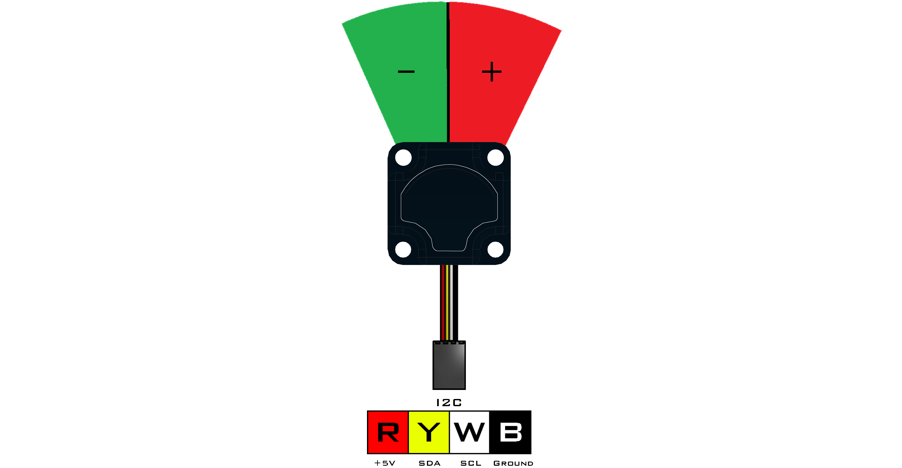

# **IR Seeker V3 (45-2017)**
-----
The IR Seeker V3 consists of 2 photodiodes to locate the direction and intensity of an IR source relative to the front of the sensor. The sensor can detect pulsed infrared light at 600Hz and 1200Hz with a 150° field of view. This device is compatible with all legacy IR sources such as the HiTechnic IR Ball, Beacon, and Beacon V2. Overall detection range is based on the intensity of the IR source being used. Overall detection range is based on the intensity of the IR source being used. 

* Connect via **I2C** port.

>[IR Seeker V3 Python Library Information](Py_IR_Seeker_V3.md)

**List of available blocks:**  

* [**Heading**](Blk_IR_Seeker_V3.md#heading)
* [**Intensity**](Blk_IR_Seeker_V3.md#intensity)

## **Heading**
>The value is **0** if the source is directly in front with a **+**/**-** change if the source moves to either side.
>
>* Read incoming infrared light at a frequency of **600Hz** or **1200Hz**.
>    
>### Block:
>
>
>
>### Code Produced:
>
>>Setup:
>>>
    seeker = Fusion.seekerV3(f)

>>Code:
>>>
    seeker.getHeading(1200)

## **Intensity**
>Measures the amount of infrared light being detected which corresponds to the distance between the sensor and source.
>
>* Read incoming infrared light at a frequency of **600Hz** or **1200Hz**.
>* The returned intensity value increases as the source approaches the sensor.
>* Value is **0** if no infrared light is detected.
>    
>### Block:
>
>
>
>### Code Produced:
>
>>Setup:
>>>
    seeker = Fusion.seekerV3(f)

>>Code:
>>>
    seeker.getIntensity(1200)

## **Questions?**
>Contact Boxlight Robotics at [support@BoxlightRobotics.com](mailto:support@BoxlightRobotics.com) with a detailed description of the steps you have taken and observations you have made.
>
>**Email Subject**: Fusion Blockly IR Seeker V3