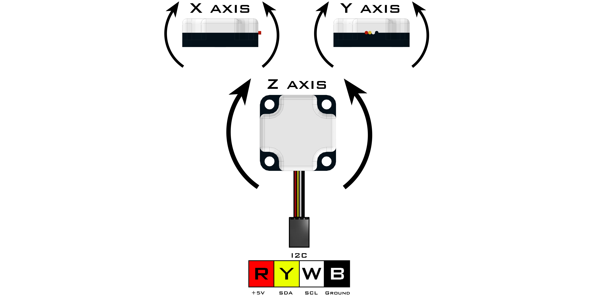

# **Integrating Gyro (45-2005)**
-----
The Integrating Gyro uses a 3-axis chip to obtain **X**, **Y** and **Z** coordinates as well as an integration of the z-axis to provide heading data. The integrated Z value is an integration of the z-axis over time and this value is used internally in heading calculations. The LED will blink at 1Hz during normal operation and will remain on during null operation (calibration). Once the null location is set, the sensor will maintain that reference until the sensor is recalibrated or zeroed.

* Connect via **I2C** port.

>[Integrating Gyro Python Library Information](Py_Integrating_Gyro.md)

**List of available blocks:**  

* [**Calibrate**](Blk_Integrating_Gyro.md#calibrate)
* [**Zero**](Blk_Integrating_Gyro.md#zero)
* [**Get Heading**](Blk_Integrating_Gyro.md#get-heading)

## **Calibrate**
>Setting the gyro to null will enable the user to calibrate their gyro. The gyro must be kept perfectly still and flat during the null operation. During the null operation, the LED will be on and remain on until calibration is complete. It is recommended that this function be called rarely as this function writes to the EEPROM every time it is called. Therefore set the gyro to **0** without writing to the EEPROM, use the [Zero](Blk_Integrating_Gyro.md#zero) block.
>
>* Takes up to **3** seconds to calibrate.
>
>### Block:
>
>
>
>### Code Produced:
>
>>
    int_gyro = Fusion.intGyro(f)
    int_gyro.setNull()
  
## **Zero**
>Sets the current heading to **0**. Does not calibrate the gyro. This is very useful for resetting the returned heading reading without needing to remain still for calibration.
>
>* Set **0** without calibration.
>
>### Block:
>
>
>
>### Code Produced:
>
>>Setup:
>>>
    int_gyro = Fusion.intGyro(f)
    
>>Code:
>>>
    int_gyro.setZero() 
 
## **Get Heading**
>Returns the current heading in degrees.
>
>* **Degrees** - Returns the cartesian reading between **0** and **359**.
>* **Absolute** - Returns the absolute reading between **-32,768** and **32,768**.
>    
>### Block:
>
>
>
>### Code Produced:
>
>>Sensor Declaration:
>>>
    int_gyro = Fusion.intGyro(f)
    
>>Sensor Code:
>>>
    int_gyro.getDegrees()
    
>>>or
>>>    
    int_gyro.getAbsolute()
    
>### Example:
>
>
>
>>Code:
>>>
    import Fusion
    import time
    f = Fusion.driver()
    int_gyro = Fusion.intGyro(f)
    int_gyro.setZero()
    while True:
        print(''.join([str(x) for x in ['Degrees: ', int_gyro.getDegrees(), '    Absolute: ', int_gyro.getAbsolute()]]))
        time.sleep(0.1)

## **Questions?**
>Contact Boxlight Robotics at [support@BoxlightRobotics.com](mailto:support@BoxlightRobotics.com) with a detailed description of the steps you have taken and observations you have made.
>
>**Email Subject**: Fusion Blockly Integrating Gyro