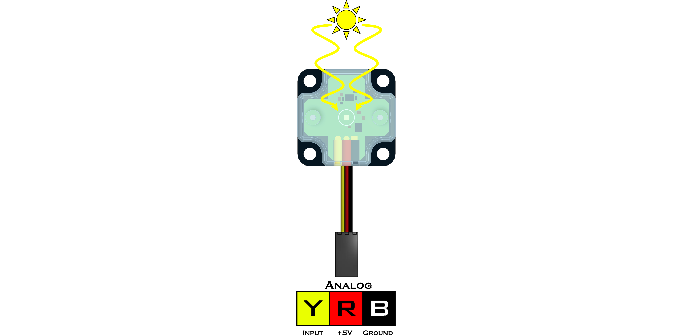

# **Light Sensor (45-2015)**
-----
The Light Sensor detects the ambient light level using a phototransistor. The value returned is a quasi-logarithmic analog value. This means that the Light Sensor can detect slight changes in light and dark environments. A value of 0 indicates no light and a value of 1023 indicates the sensor is flooded with light.

* Connect via analog port **A0** - **A7**.

>[Light Sensor Python Library Information](Py_Light_Sensor.md)  

**List of available blocks:**  

* [**Read**](Blk_Light_Sensor.md#read)

## **Read**
>Measures the amount of ambient light detected on the top side of the sensor.
>
>* The returned reading ranges from **0** - **1023**.
>    
>### Block:
>
>

>
>### Code Produced:
>
>>Setup:
>>>
    light_A0 = Fusion.analog(f, f.A0)

>>Code:
>>>
    light_A0.read()

## **Questions?**
>Contact Boxlight Robotics at [support@BoxlightRobotics.com](mailto:support@BoxlightRobotics.com) with a detailed description of the steps you have taken and observations you have made.
>
>**Email Subject**: Fusion Blockly Light Sensor