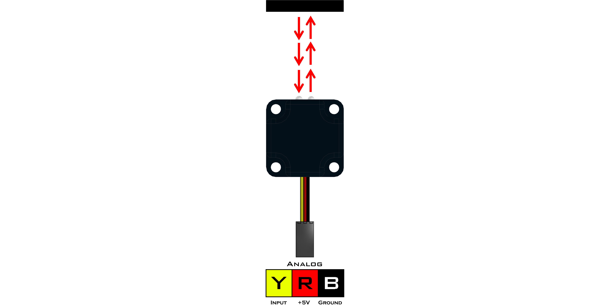

# **Optical Distance Sensor (45-2006)**
-----
The Optical Distance Sensor (ODS) is an analog sensor that uses electro optical proximity detection to calculate distance from an object based on the intensity of the light. This sensor can calculate distances between 1cm to 15cm. Lighter colored objects will return a more accurate and consistent reading, the material also plays a part on the returned value. Try different colors and material to see what works best for you. The ODS can be used for object detection, line detection and the difference between light and dark.

* Connect via analog port **A0** - **A7**.

>[Optical Distance Sensor Python Library Information](Py_Optical_Distance_Sensor.md)  

**List of available blocks:**  

* [**Read**](Blk_Optical_Distance_Sensor.md#read)

## **Read**
>Read the proximity of an object using pulsed visible light.
>
>* The returned reading ranges from **0** - **1023**.
>* Detectable proximity ranges from **1** cm to **15** cm.
>* Returned reading is an exponential decay.
    * Value increases as the object approached the sensor.

>### Block:
>
>
>
>### Code Produced:
>
>>Setup:
>>>
    ods_A0 = Fusion.analog(f, f.A0)

>>Code:
>>>
    ods_A0.read()
    
>### Example:
>
>
>
>>Code:
>>>
    import Fusion
    f = Fusion.driver()
    my_ods = None
    ods_A2 = Fusion.analog(f, f.A2)   
    my_ods = ods_A2.read()

## **Questions?**
>Contact Boxlight Robotics at [support@BoxlightRobotics.com](mailto:support@BoxlightRobotics.com) with a detailed description of the steps you have taken and observations you have made.
>
>**Email Subject**: Fusion Blockly Optical Distance Sensor