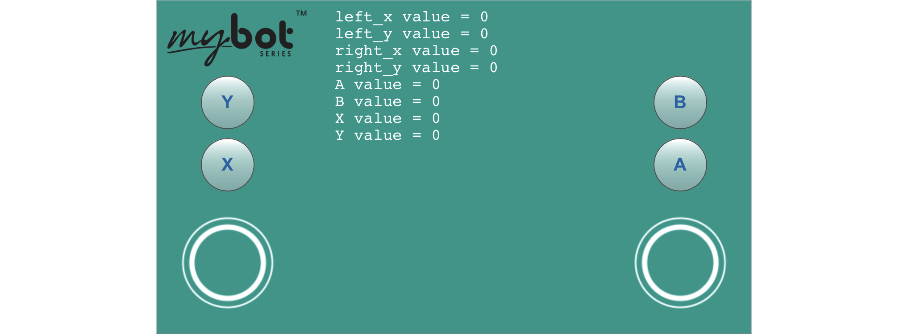

# **Virtual Gamepad**
-----
This library allows you to display and use a virtual gamepad right on your touch screen device to control the Fusion. The Virtual Gamepad comes with 2 joysticks and 4 buttons that are controlled using the functions below.  
Once the code is written, start the python program and click the Virtual Gamepad button on the toolbar to open the window. The Virtual Gamepad window will open on the current IP address on port 5000 (Default: **my.bot:5000** or *192.168.50.1:5000*) in a new tab.

>[Virtual Gamepad Python Library Information](Py_VirtualGamepad.md)  

**List of available blocks:**  

* [**Read Joystick**](Blk_VirtualGamepad.md#read-joystick)
* [**Read Button**](Blk_VirtualGamepad.md#read-button)
* [**Telemetry**](Blk_VirtualGamepad.md#telemetry)
* [**Camera**](Blk_VirtualGamepad.md#camera)

## **Read Joystick**
>Read the X-axis and Y-axis of the **Left** or **Right** joystick. The values range from -100 to 100 on each axis.  
>Setting **Mixer** to True will combine the X-axis and Y-axis values to allow for tank style driving.   
>The **X-Invert** and **Y-Invert** will flip the positive/negative direction of the joystick.
>   
>### Block:
>
>
>
>### Code Produced:
>
>>Setup:
>>>
    import VirtualGamepad
    v = VirtualGamepad.service()

>>Code:
>>>
    v.leftJoystick(False, False, False)
    or
    v.rightJoystick(False, False, False)
    
>### Example:
>
>  
>
>>Code:
>>>
    import Fusion
    import VirtualGamepad
    f = Fusion.driver()
    v = VirtualGamepad.service()
    left = None
    right = None
    while True:
        left = v.leftJoystick(False, False, False)
        right = v.rightJoystick(False, False, False)
        f.motorSpeed(f.M0, right[1])
        f.motorSpeed(f.M1, left[1])
        
## **Read Button**
>>Read a button from the Virtual Gamepad. The button returns a *1* when it is pressed and a *0* when it is not pressed.  
>There are 4 available buttons: 
>>
>>* **A**  
>>* **B**  
>>* **X**  
>>* **Y**
>
>### Block:
>
>
>
>### Code Produced:
>
>>Setup:
>>>
    import VirtualGamepad
    v = VirtualGamepad.service()

>>Code:
>>>
    v.readButton('A')
    
## **Telemetry**
>Print valuable data to the Virtual Gamepad screen. This is very useful when wanting to read the return values from sensors or the Virtual Gamepad functions.  
>The **Line** parameter refers to which line of the Virtual Gamepad screen that data will print to. **Value** is the data you want to print to the screen. You can print plain text or the return of a sensor or joystick block.
>   
>### Block:
>
>
>
>### Code Produced:
>
>>Setup:
>>>
    import VirtualGamepad
    v = VirtualGamepad.service()

>>Code:
>>>
    v.telemetry(0, 'abc')
    
>### Example:
>
>
>
>>Code:
>>>
    import Fusion
    import VirtualGamepad
    f = Fusion.driver()
    v = VirtualGamepad.service()
    while True:
        v.telemetry(0, str(str('left joystick = ') + str(v.leftJoystick(False, False, False))))
        v.telemetry(1, str(str('right joystick = ') + str(v.rightJoystick(False, False, False))))
        v.telemetry(2, str(str('Btn A = ') + str(v.readButton('A'))))
        v.telemetry(3, str(str('Btn B = ') + str(v.readButton('B'))))
        v.telemetry(4, str(str('Btn X = ') + str(v.readButton('X'))))
        v.telemetry(5, str(str('Btn Y = ') + str(v.readButton('Y'))))
        
## **Camera**
>Adding this block will enable the use of a USB camera or PiCamera to live stream video back to the virtual gamepad background. A camera must be attached to the Fusion in order to use this block or an exception will occur when the drivers are initialized. This block can be added or removed to an existing program and is necessary only for camera feedback.  
>The **Resolution** fields allow the user to change the default resolution of *(320x240)* to any defined value supported by their selected camera.  
>**Frames Per Second** is the rate at which the live stream frames are displayed to screen. Default is *10*fps however can be increased depending on the camera abilities and WiFi connection strength.  
>**Mode** refers to the type of camera that is connected to the device. The default mode is *'YUV'* however *'MJPG'* and *'PICAM'* are also supported. Certain cameras may work better on one mode than the other and the user should refer to the manufacturer documentation or support to determine what modes are supported.  
>   
>### Block:
>
>
>
>### Code Produced:
>
>>Setup:
>>>Changes this:
>>>
    import VirtualGamepad
    v = VirtualGamepad.service()
>>>To this:
>>>
    import VirtualGamepad
    v = VirtualGamepad.service(True, (320,240), 10, 'YUV')
    
>### Example:
>
>
>
>>Code:
>>>
    import Fusion
    import VirtualGamepad
    f = Fusion.driver()
    v = VirtualGamepad.service(True, (320,240), 10, 'YUV')
    left = None
    while True:
        left = v.leftJoystick(True, False, False)
        f.motorSpeed(f.M0, left[0])
        f.motorSpeed(f.M1, left[1])

## **Questions?**
>Contact Boxlight Robotics at [support@BoxlightRobotics.com](mailto:support@BoxlightRobotics.com) with a detailed description of the steps you have taken and observations you have made.
>
>**Email Subject**: Fusion Blockly Virtual Gamepad