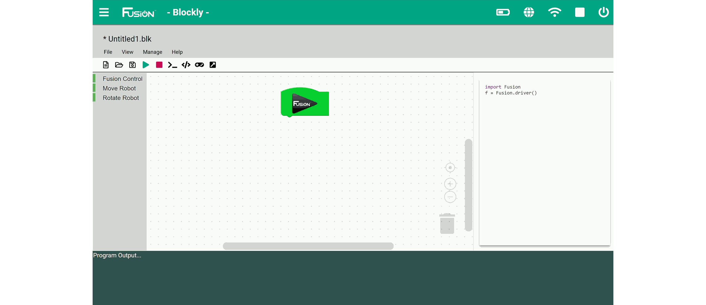
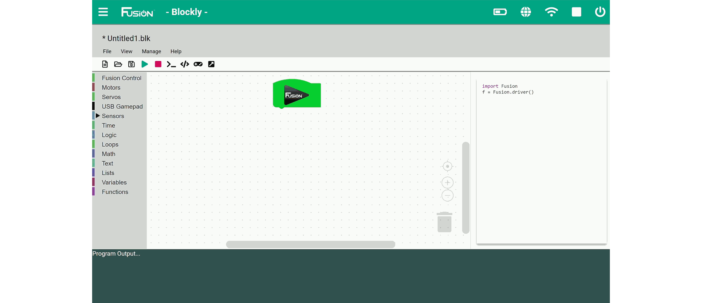
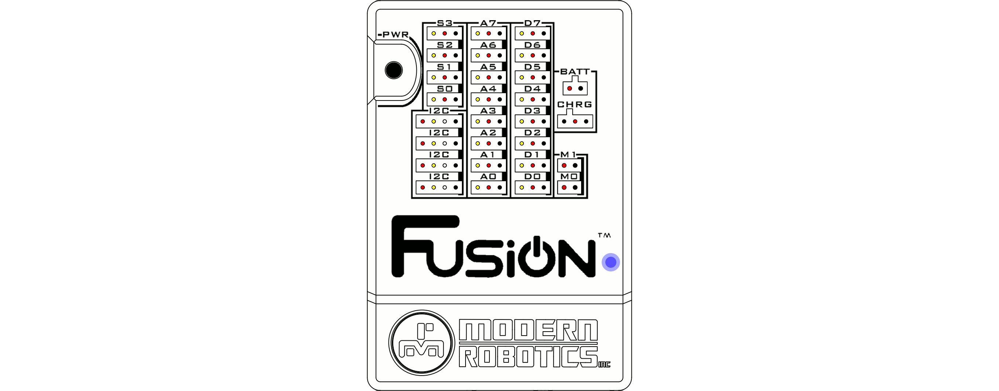

# **Blockly Guide**
-----
Refer to the [Blockly Library Informtation](Blockly_Topic.md) for available programming blocks.
## **Create a new program**
>To create a new program from the Home screen, click the **LAUNCH** button in the Blockly box.
>
>
>
>A program will open that is listed at Untitled**X**.blk where **X** is an incrementing number. Click the save button to save the file with a new name. For our example we will name the file *myprog* which will result in a file being created call *myprog.blk*.  
>Every new program has a start block placed in the programming environment.

## **Open an existing program**
>To open an existing program, click the open file button and select the program you want to open. The program will open in the programming environment as it was the last time it was saved.

## **Writing a LED flashing program (Basic)**
>First, make sure you are on the Basic Blockly screen by going to *View -> Mode -> Basic* in the toolbar. This example will show how to create a Blockly program to toggle the onboard yellow and blue LEDs. After opening a new program, the program environment contains just the [Start Block](Basic_Fusion-Control.md#start-block).  
>>
>
>**1)** Go to the **Fusion Control** toolbox and drag out the [Yellow LED Block](Basic_Fusion-Control.md#yellow-led-on) and attach it to the start block like shown.
>
>>
>
>**2)** Now we are going to add a delay so the yellow LED will stay on for 1 second before the next LED block. Go to the **Fusion Control** toolbox and drag out the [Wait Block](Basic_Fusion-Control.md#wait).
>
>>
>
>**3)** Go to the **Fusion Control** toolbox and drag out the [Blue LED Block](Basic_Fusion-Control.md#blue-led-on) and attach it to the wait block from the previous step. Now the yellow LED will turn on for 1 second and then switch to blue.
>
>>
>
>**4)** Go to the **Fusion Control** toolbox and drag the [Wait Block](Basic_Fusion-Control.md#wait) to the blue LED block. Now the yellow LED will turn on for 1 second, turn off and the blue LED will turn on for 1 second.
>
>>
>
>**5)** In the toolbar at the top of the page, click "Run" to start running (also saves) the current program. You should observe the following:
>>*1.* Only the Yellow LED turns on for 1 second.  
>>*2.* Only the Blue LED turns on for 1 second.  
>>*3.* The program will end and both LEDs will be off.
>
>>
>>
>>

## **Writing a LED flashing program (Intermediate)**
>First, make sure you are on the Intermediate Blockly screen by going to *View -> Mode -> Intermediate* in the toolbar. This example will show how to create a Blockly program to continuously toggle the onboard yellow and blue LEDs. After opening a new program, the program environment contains just the [Start Block](Int_Fusion-Control.md#start-block).
>
>>
>
>**1)** Go to the **Loops** toolbox and drag out the [Repeat While True Block](Default_Loops.md#repeat) 
>
>>
>
>**2)** Go to the **Fusion Control** toolbox and drag out 2 of the [LED Blocks](Int_Fusion-Control.md#led) and attach them inside the loop like shown. Change the lower block to *blue* and set it to *off*.
>
>>
>
>**3)** Go to the **Time** toolbox and drag out the [Wait **X** Seconds Block](time.md#wait-in-seconds) and attach it under the LED blocks. Change the number in the center to the desired length of time for the yellow LED to stay on. For this example, we will leave the time at 1 second.
>
>>
>
>**4)** Go to the **Fusion Control** toolbox and drag out 2 more of the [LED Blocks](Int_Fusion-Control.md#led) and attach them below the wait block. This time turn the yellow LED *off* and the blue LED *on*.
>
>>
>
>**5)** Go to the **Time** toolbox and drag out the [Wait **X** Seconds Block](time.md#wait-in-seconds) and attach it under the LED blocks.
>
>>
>
>**6)** In the toolbar at the top of the page, click "Run" to start running (also saves) the current program. You should observe the following:
>>*1.* Only the Yellow LED turns on for 1 second.  
>>*2.* Only the Blue LED turns on for 1 second.  
>>*3.* The program will continually loop and flash the LEDs until "Stop" is selected in the toolbar.
>
>>
>>
>>

## **Questions?**
>Contact Boxlight Robotics at [support@BoxlightRobotics.com](mailto:support@BoxlightRobotics.com) with a detailed description of the steps you have taken and observations you have made.
>
>**Email Subject**: Fusion Blockly Programming