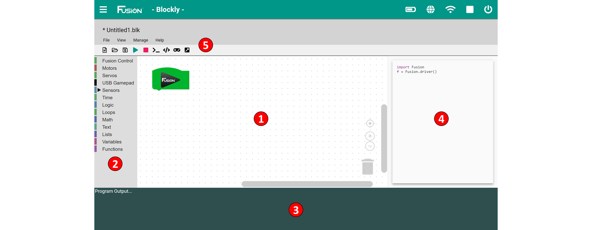

# **Blockly Reference**
-----
Blockly is a visual programming environment designed for beginner programmers aimed to teach programming techniques. Blocky for Fusion comes with **Basic** and **Intermediate** modes which adds another level of complexity.  
Basic Blockly comes with blocks to control the motors which will drive and rotate the robot. There are also blocks to toggle the on-board yellow and blue LEDs on and off.  
Intermediate mode comes with more complex blocks to control motors independently, control servos and our entire range of sensors.

>1) **Program Environment**  
>>* This is the space where blocks are placed and connected to create programs.
>>* There are both vertical and horizontal scrolling bars for navigating larger programs.
>>* The icons in the bottom right are used to help you view your environment and delete blocks.
>>>* The **reticle** is used to center the block program within the program environment.
>>>* The **+** icon is used to zoom in on the program.
>>>* The **-** icon is used to zoom out from the program. 
>>>* The **trashcan** icon is used to delete a block or chunk of blocks by dragging the blocks over the trashcan.
>
>2) **Toolbox**
>>* Contains all available programming blocks organized by category.
>
>3) **Program Output** 
>>* This window can be toggled on and off.
>>* Displays the output of the program generated using the print block or an error from the Controller.
>
>4) **Code Window**
>>* This window can be toggled on and off.
>>* Displays the Python code that is produced by the blocks. This code can be copied, pasted and run directly from the [Editor](Editor.md).
>
>5) **Toolbar**
>>* **File** - Gives the option to Create, Open, Close, Save, Delete and Print a file.
>>* **View** - Switch modes between Basic and Intermediate, also to show/hide the Program Output and Code Window.
>>* **Manage** - Import or Export a file.
>>* **Help** - Access controller and sensor examples as well as a link to the documentation.
>>
>>* **New File** - Opens a new file with Fusion import and driver lines in code.
>>* **Open File** - Open a file that exists in the current user's file directory.
>>* **Save File** - Save the current file that is highlighted in Working Files.
>>* **Save All Files** - Save all the current files the Working Files.
>>* **Run Program** - Run the current program that is highlighted in Working Files.
>>* **Stop Program** - Stop the current running program.
>>* **Toggle Program Output** - Show and Hide the Program Output at the bottom of the screen.
>>* **Toggle Code Window** - Show and Hide the Code Window to the right of the Program Environment.
>>* **Open Virtual Gamepad** - Open the Virtual Gamepad in a new tab. (Must run the program first)

## **Use Guide**
>**1. [Create a program (Basic & Intermediate)](Blockly.md)**  

## **Basic Block Reference**
>**1. [Control Robot](Basic_Fusion-Control.md)**  
>**2. [Move Robot](Basic_Move-Robot.md)**  
>**3. [Rotate Robot](Basic_Rotate-Robot.md)**  

## **Intermediate Block Reference**
>**1. [Control Robot](Int_Fusion-Control.md)**  
>**2. [Motor Control](Int_Motors.md)**  
>**3. [Servo Control](Int_Servos.md)**  
>**4. [USB Gamepad](Blk_usbGamepad.md)**  
>**5. [Virtual Gamepad](Blk_VirtualGamepad.md)**  
>**6. [Analog/Digital Sensors](Blk_Analog_Digital.md)**  
>**7. [Compass (45-2003)](Blk_Compass.md)**  
>**8. [Rate Gyro (45-2004)](Blk_Rate_Gyro.md)**  
>**9. [Integrating Gyro (45-2005)](Blk_Integrating_Gyro.md)**  
>**10. [Optical Distance Sensor (45-2006)](Blk_Optical_Distance_Sensor.md)**  
>**11. [Touch Sensor (45-2007)](Blk_Touch_Sensor.md)**  
>**12. [Range Sensor (45-2008)](Blk_Range_Sensor.md)**  
>**13. [Infrared Locator 360° (45-2009)](Blk_IR_Locator_360.md)**  
>**14. [Light Sensor (45-2015)](Blk_Light_Sensor.md)**  
>**15. [Sound Generator (45-2016)](Blk_Sound_Generator.md)**  
>**16. [Infrared Seeker V3 (45-2017)](Blk_IR_Seeker_V3.md)**  
>**17. [Color Sensor (45-2018)](Blk_Color_Sensor.md)**  
>**18. [Color Beacon (45-2019)](Blk_Color_Beacon.md)**  
>**19. [Magnetic Sensor(45-2020)](Blk_Magnetic_Sensor.md)**  
>**20. [Time](time.md)**  
>**21. [Logic](Default_Logic.md)**  
>**22. [Loops](Default_Loops.md)**  
>**23. [Text](Default_Text.md)**  
>**24. [Lists](Default_Lists.md)**  
>**25. [Variables](Default_Variables.md)**  
>**26. [File Handling](Blk_File_Handling.md)**