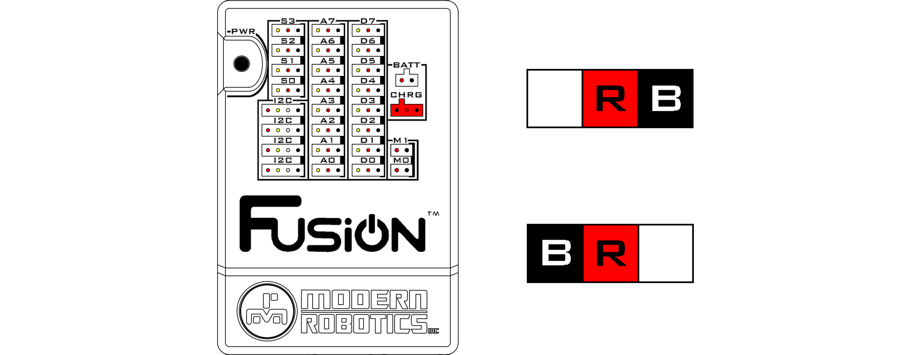

# **Charging the Fusion battery**
-----
## **How to charge the battery**
>To charge the Fusion battery pack, first make sure the [battery is connected](Connect_Battery.md).  
>Then connect the accompanying battery charger to the battery port on the Fusion. The Fusion must be off in order to charge the battery. If the Fusion is on while the battery and charger are connected, the battery will not be charged. The charger is wired with the power in the middle and a ground on either side. Therefore this connector can not be connected improperly.
>
>
>
>When the charger is connected and charging the battery, the light on the charger will turn red. Once the battery is fully charged the light will turn green. The charger may get warm when charging a battery..

## **Questions?**
>Contact Boxlight Robotics at [support@BoxlightRobotics.com](mailto:support@BoxlightRobotics.com) with a detailed description of the steps you have taken and observations you have made.
>
>**Email Subject**: Charging the Fusion Battery