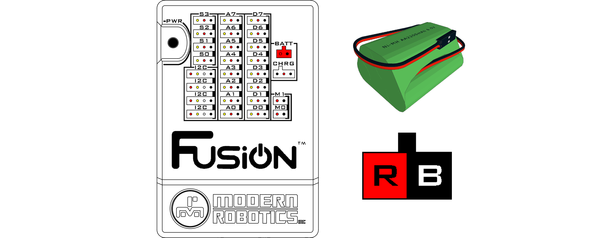

# **Connecting a battery**
-----
## **How to connect the battery**
>Connect the Fusion Battery pack for a truly wireless experience. The Fusion uses a 6V 2200mAh Ni-MH battery with a polarized connection designed to have the power on the left and the ground on the right. The battery has a keyed connection that only allows for it to be connected to the battery port in one direction.
>
>
>**DO NOT** connect any other power source to the battery port. Only use the Fusion 6V Battery with Fusion. Using another power source or reverse polarity could permanently damage your Fusion.

## **Questions?**
>Contact Boxlight Robotics at [support@BoxlightRobotics.com](mailto:support@BoxlightRobotics.com) with a detailed description of the steps you have taken and observations you have made.
>
>**Email Subject**: Connecting Fusion Battery