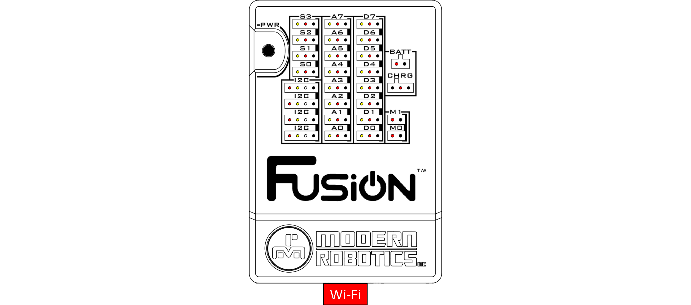

# **Connect Fusion to the Internet**
-----
## **Connect to the internet via Wi-Fi**
>**1.** Connect the Wi-Fi dongle supplied by Boxlight Robotics to your Fusion via the [USB Hub](USB_Hub.md). Refer to the [Wi-Fi Hub](WiFi_Hub.md) for more information on how wireless connections are made with the Fusion.

>**1.** Open the Fusion settings from the hamburger menu on the left or the settings box on the home page.

>**2.** Navigate to the **WIRELESS** menu.

>**3.** In the **Wireless Networks** section, look at the list of available networks for your wireless router. Click on the router SSID(name) to start the internet connection process. 

>**4.** Click **Connect** to connect to the selected network

>**5.** Enter the correct passkey for that network and click **OK** to connect.  
>This process may take a few moments to connect to the internet.

## **Connect to the internet via Ethernet Cable**
>**1.** Connect an ethernet cable (CAT5e or CAT6) to the Fusion [Ethernet Port](Ethernet_Port.md). Connect the other end of the cable to your router or modem.

>The Fusion will automatically connect to the internet. This process may take a few moments.

## **Questions?**
>Contact Boxlight Robotics at [support@BoxlightRobotics.com](mailto:support@BoxlightRobotics.com) with a detailed description of the steps you have taken and observations you have made.
>
>**Email Subject**: Connect Fusion to the Internet