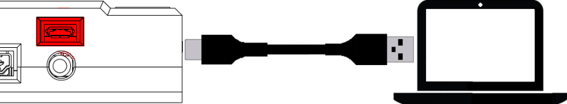

# **Connect USB power**
-----
## **Connect Fusion with supplied USB cable**
>The USB cable included with you Fusion is a USB-Micro to USB-A cable. 
>
>The micro end of the cable connects to the Fusion via the USB-Micro port on the side of the controller. This port is for power only and does not transfer any data. The standard USB-A end of the cable connects to the computer or power supply capable of 5V at a minimum of 500mA.  
>  
Once connected, a green LED near the Micro USB port will illuminate to show that the Fusion is connected to power.

## **Try Another USB-A port**
>If the USB LED is not turning on when the USB cable is connected, try connecting the USB-A end of the cable into another USB port.

## **Questions?**
>Contact Boxlight Robotics at [support@BoxlightRobotics.com](mailto:support@BoxlightRobotics.com) with a detailed description of the steps you have taken and observations you have made.
>
>**Email Subject**: Fusion USB Power