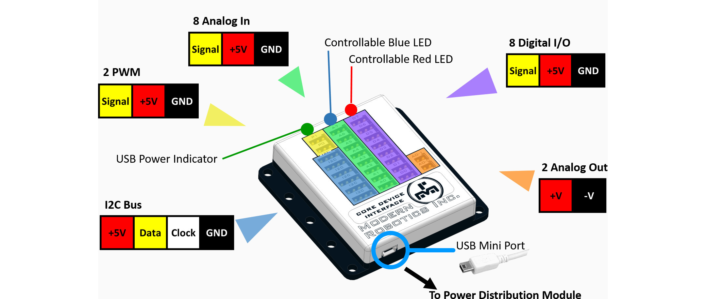

# **Core Device Interface (45-2201)**
-----
The Core Device Interface (CDI) connects external sensors and other devices. With a total of 26 port connections divided into 5 general classes, the CDI gives a convenient way to attach a wide range of our sensors, or brew your own devices and control your world.

>**Power** : 5V DC, 200mA max  
>**Total Port Power** : 5V DC, 150mA max  
>**USB Driver** : FTDI VCP  
>**USB Connection** : USB-Mini  
>**Digital Logic Level** : 5V TTL  
>**Digital Series Resistor** : 220 ohm  
>**Digital Current Limit** : 22mA  
>**Analog Voltage Levels** : 0V - 5V DC  
>**Analog Resolution** : 10 bit  
>**Analog Output Voltage Levels** : -4V - +4V  
>**Analog Output Modes** : DC, Sine, Square or Triangle  
>**Analog Output Frequency** : 0Hz - 8kHz  
>**Analog Output Current Limit** : 4mA  
>**I2C Bus** : 100kHz with 27 Byte buffer  
>**I2C Logic Level** : 5V TTL  
>**I2C Pull-Up Resistor** : 47k ohm  
>**I2C Series Resistor** : 47 ohm  
>**PWM Logic Level** : 5V TTL  
>**PWM Output Frequency** : 1uS - 65,535uS  
>**PWM Series Resistor** : 220 ohm  
>**PWM Current Limit** : 22mA  
>**Dimensions** : 72mm x 73mm x 16.2mm  
>**Weight** : 45 grams

>[Core Device Interface Visual Programming Blocks](Blk_Core_Device_Interface.md)  
>[Core Device Interface Python Library Information](Py_Core_Device_Interface.md)  

## **Questions?**
>Contact Boxlight Robotics at [support@BoxlightRobotics.com](mailto:support@BoxlightRobotics.com) with a detailed description of the steps you have taken and observations you have made.
>
>**Email Subject**: Fusion Core Device Interface