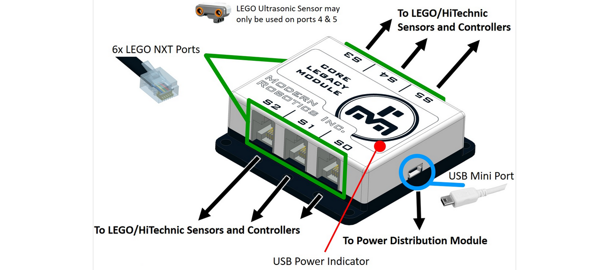

# **Core Legacy Module (45-2202)**
-----
Our Core Legacy Module provides backward compatibility to enable LEGO NXT devices. The Legacy Module has six (6) ports and virtually any combination of devices can be connected to the module. The Legacy module firmware supports all NXT LEGO sensors, HiTechnic sensors, Matrix controllers as well as the HiTechnic Tetrix motor and servo controllers. The Fusion can read and write each device separately and by utilizing the speed of the USB connection, a program can read all 6 ports at once. The Legacy Module is powered from the USB connection. Each Legacy Module port can operate in digital as well as analog modes. In digital mode, legacy connector pins 5 and 6 can be set to logic 0 or logic 1. In analog mode, the voltage on legacy connector pin 1 is measured using a 10 bit analog to digital converter. Additionally, pins 5 and 6 can be set to logic 0 or logic 1 for control of the attached device, such as a LEGO light sensor which uses pin 5 to turn the sensor LED on and off. In I2C mode, legacy connector pins 5 and 6 are used to communicate with I2C devices in accordance with the LEGO interpretation of I2C. Ports 4 and 5 can additionally be switched into pin 1 9V supply mode to permit LEGO ultrasonic range sensors to be used.

>**Power** : 5V DC, 200mA max  
>**Supported Devices** : LEGO NXT sensors, HiTechnic sensors and controllers  
>**USB Driver** : FTDI VCP  
>**USB Connection** : USB-Mini  
>**Analog and Digital Ports** : 5V TTL with 9V option on S4 and S5  
>**I2C** : 27 Byte data buffer per port  
>**Dimensions** : 72mm x 73mm x 73mm   
>**Weight** : 53 grams

>[Core Legacy Module Visual Programming Blocks](Blk_Core_Legacy_Module.md)  
>[Core Legacy Module Python Library Information](Py_Core_Legacy_Module.md)  

## **Questions?**
>Contact Boxlight Robotics at [support@BoxlightRobotics.com](mailto:support@BoxlightRobotics.com) with a detailed description of the steps you have taken and observations you have made.
>
>**Email Subject**: Fusion Core Legacy Module