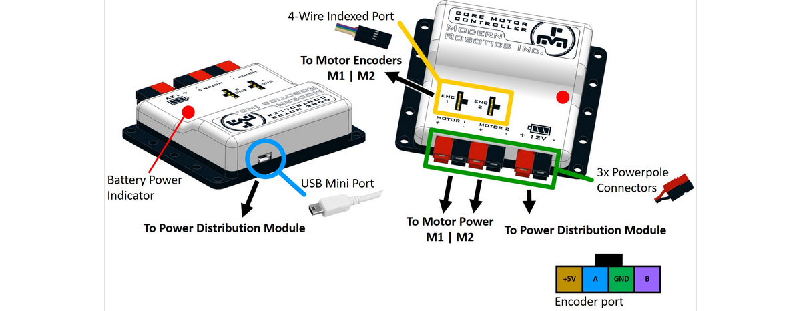

# **Core Motor Controller (45-2203)**
-----
The Core Motor Controller has two motor channels to connect 9V – 15V DC motors. Through the Motor Controller functions, you can control the speed and direction of each motor. Each motor channel port has an encoder for feedback. The Core Motor Controller is powered by the Core Power Distribution Module using the supplied power cable.  
The Motor Controller has three models for motor control and each channel can be independently controlled by the user program. The three modes of operation are;

* **Run with Constant Power** – Set the motor speed and direction.  
* **Run at Constant Speed** – Set the desired motor speed and the controller will maintain that speed, even if there is a change of load on the motor.  
* **Run to Position** – Set the desired encoder position and the controller will move the motor until the target position is reached and then it will maintain that motor position.

Motor channels can be set to reverse so that motors on the left and right side of the robot drive forwards when both given a positive power.  

>**Power** : 9V - 15V DC, 10A max  
>**Motor Power** : 9V - 15V DC, 5A max  
>**Motor Encoder** : Two phase, 5V DC, 50mA max  
>**USB Driver** : FTDI VCP  
>**USB Connection** : USB-Mini  
>**Constant Power** : -100% - +100%  
>**Constant Speed** : -100% - +100%  
>**To Position** : Constant Speed to position with 32 bit value  
>**Brake Mode** : FLOAT or BRAKE  
>**Battery Voltage Monitoring** : 0V - 20V with 20mV resolution  
>**Dimensions** : 72mm x 88mm x 24mm  
>**Weight** : 67 grams  

>[Core Motor Controller Visual Programming Blocks](Blk_Core_Motor_Controller.md)  
>[Core Motor Controller Python Library Information](Py_Core_Motor_Controller.md)  

## **Questions?**
>Contact Boxlight Robotics at [support@BoxlightRobotics.com](mailto:support@BoxlightRobotics.com) with a detailed description of the steps you have taken and observations you have made.
>
>**Email Subject**: Fusion Core Motor Controller