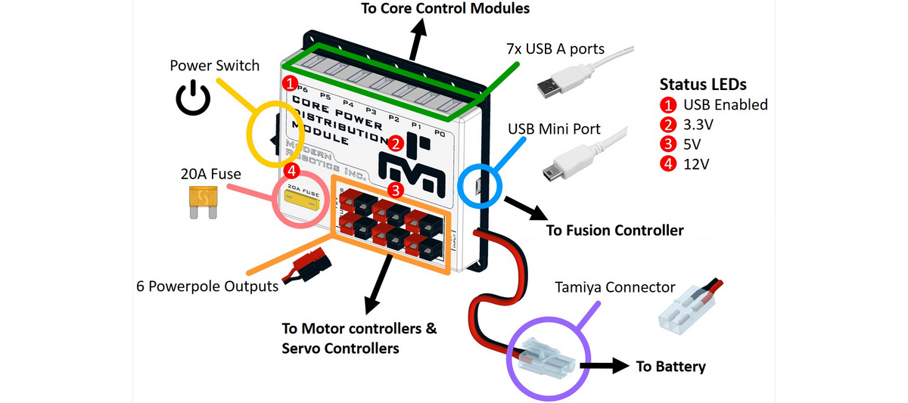

# **Core Power Distribution Module (45-2200)**
-----
Our Core Power Distribution Module incorporates a 7 port USB 2.0 hub and 6 x 12V power distribution terminals with Anderson PowerPole® connectors. The Power Distribution Module offers a convenient and safe way to wire your robot's 12V supply from the battery to all motor, servo and other modules that require 12V. All modules are protected by a 20A replaceable fuse and an integrated on/off switch.  
Included with the Power Distribution Module is 1 On-The-Go cable to connect the module to an Android device. The OTG cable is USB-Micro to USB-Mini.

>**Power** : 9V- 15V DC, 20A max  
>**Total Port Power Limit** : 9V - 15V DC, 18A max (sum of all ports not to exceed max power limit)  
>**Individual USB Hub Current Limit** : 500mA max  
>**Total USB Hub Current Limit** : 4A max  
>**USB Control Connection** : USB-Mini, no 5V connection  
>**USB Hub Connection** : 7 Ports, USB-A   
>**Number of Power Ports** : 6 Ports max  
>**Dimensions** : 96mm x 105mm x 24mm  
>**Weight** : 138 grams   

**12V** – Indicates 12v supply is connected and the power switch is on.  
**5V** – Indicates the 5v power supply is operating and supplying 5v to the USB ports.  
**3.3V** – Indicates the 3.3 volt supply to the internal electronics is operating.  
**USB Enabled** – Indicates a host device is connected to the USB input port.

## **Questions?**
>Contact Boxlight Robotics at [support@BoxlightRobotics.com](mailto:support@BoxlightRobotics.com) with a detailed description of the steps you have taken and observations you have made.
>
>**Email Subject**: Fusion Core Power Distribution Module