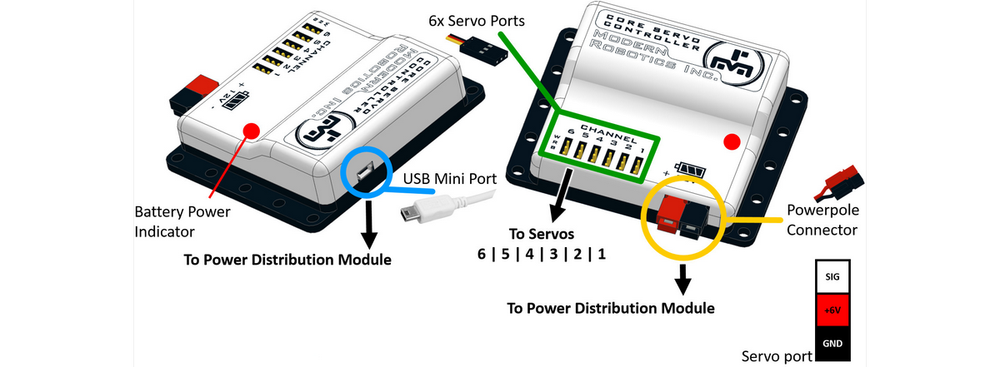

# **Core Servo Controller (45-2204)**
-----
The Core Servo Controller has six (6) servo ports to connect 6V digital or analog servos. The position of each servo can be independently set and once set the servo will move to the desired position.

>**Power** : 9V - 15V DC, 4A max  
>**Servo Power Limit - Continuous** : 6V DC, 5A  
>**Servo Power Limit - Peak** : 6V DC, 6A  
>**USB Driver** : FTDI VCP  
>**USB Connection** : USB-Mini  
>**Servo Logic Level** : 5V TTL  
>**Servo Range** : 750uS - 2250uS  
>**Servo Extended Range** : 500uS - 2500uS  
>**Series Resistor** : 470 ohm  
>**Dimensions** : 72mm x 88mm x 24mm  
>**Weight** : 70 grams 

>[Core Servo Controller Visual Programming Blocks](Blk_Core_Servo_Controller.md)  
>[Core Servo Controller Python Library Information](Py_Core_Servo_Controller.md)  

## **Questions?**
>Contact Boxlight Robotics at [support@BoxlightRobotics.com](mailto:support@BoxlightRobotics.com) with a detailed description of the steps you have taken and observations you have made.
>
>**Email Subject**: Fusion Core Servo Controller