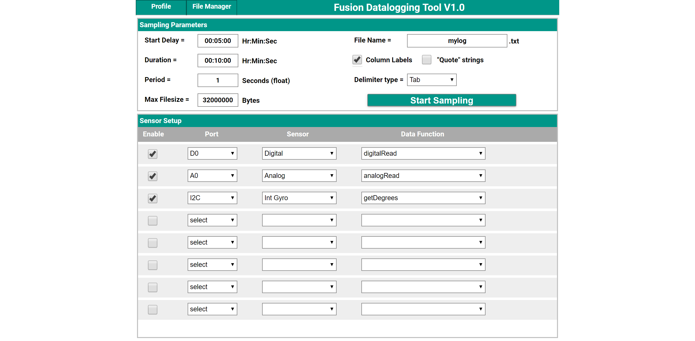
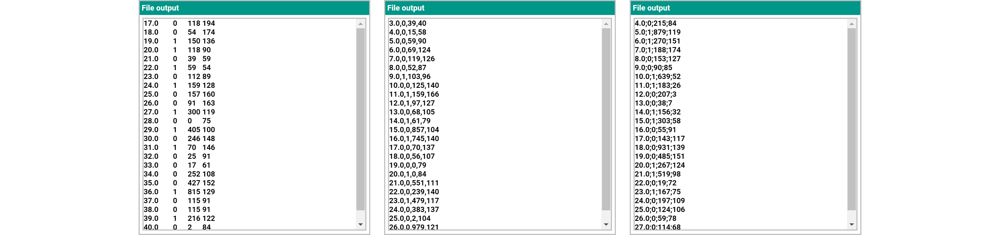
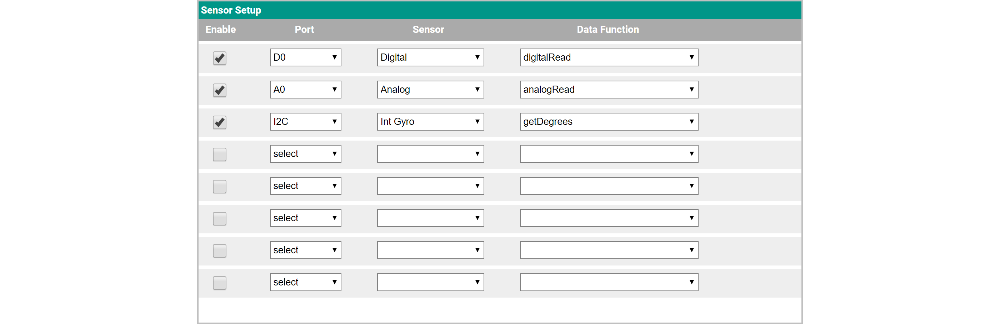
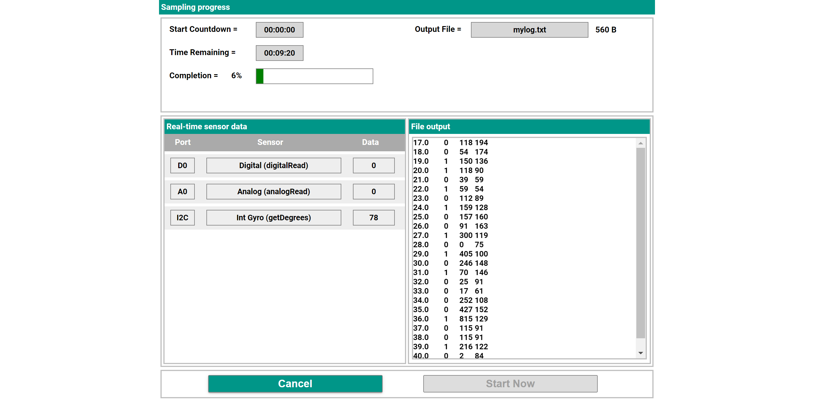
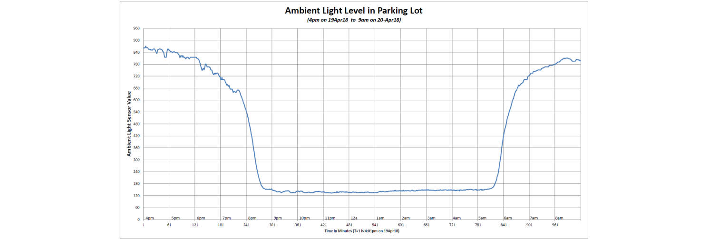

# **Data Logging Tool**
-----
The Data Logging Tool feature of the Fusion Controller allows you to collect and store readings collected from one or more sensors over a period of time. While not something that a robot might use, it is a very valuable function when conducting experiments or studying natural phenomena. For example, with an ambient light sensor, you can have the Fusion measure the light level in a greenhouse every minute over a 24 hour period to examine how light affects the plant growth. Or, using an accelerometer, you can measure the G-Forces 100 times every second while a robotic cart is rolling down an incline and crashing into a wall.  
The data collected with the data logger function is stored in a delimited text file that can easily be read into a spreadsheet program and graphed for analysis or presentation.

The **Profile** tab on the top bar allows you to *Save* a profile, *Load* a profile or *Create a New* profile. Saving a profile saves the information in the [Sampling Paramters](Data_Logging_Tool.md#sampling-parameters) window as well as the selected sensors and function in the [Sensor Setup](Data_Logging_Tool.md#sensor-setup) window. Saving profiles makes it much easy to run multiple experiments without having to remember and setup the experiment every time.   
The **File Manager** tab on the top bar has the options to *Export* and *Delete* log files (.txt) or profiles. Exporting a file allows you to download it to your computer so that it can be imported into a spreadsheet or graphing software. Refer to the section [Log File Usage](Data_Logging_Tool.md#log-file-usage) on using the log file.

## **Sampling Parameters**  

>**Start Delay** is the amount of time before the sampling will begin. This is useful for starting the sampling at a desired time without having to be present.  
>**Duration** is the length of time the sampling will take place.  
>**Period** is the time interval between samples. In the example above a same is taken every 1 second. The smallest allowed time interval between samples is 0.01 seconds.  
>**Max Filesize** is a limiter on the size of a log file which, when reached, will stop the sampling. The default is set to 32,000,000 Bytes (32MB). The only reason to modify this value would be if a log file requires multiple sensors over several hours. Experiment with smaller sample sizes to get an idea of possible file sizes.  
>**File Name** is the name of the saved text files that will contain all the sampling data. Creating a text file with the same name of a file that already exists will automatically overwrite the file.  
>**Column Labels** will add the proper labels for each column at the top of the text file. Therefore when the file is imported into a spreadsheet all of the columns are properly labeled.  
>**"Quote" strings** puts quotes around the column labels.  
>**Delimiter Type** refers to how the data is separated. The data is separated by a *Tab*, *Comma* or *Semicolon*. Below are examples of how the data is produced depending on the delimiter type selected. The data displayed is organized by the following columns (based on Sensor Setup): *Time*, *Digital Read*, *Analog Read*, *Get Degrees*.

>

>The **Start Sampling** button will advance to the [Sampling Screen](Data_Logging_Tool.md#sampling) screen.

## **Sensor Setup**  

><table style="width:95%" align="center" border="2">
    <tr><th style="width:25%">
**Enable**
</th><th style="width:25%">
**Port**
</th><th style="width:25%">
**Sensor**
</th><th style="width:25%">
**Function**
</th></tr>
    <tr><td>
Checking this box adds the sensor to list of sensors to be sampled and logged.
</td><td>
Displays a list of available sensor ports. Select the port the sensor to be sampled is connected to.
</td><td>
Select if the sensor is Analog, Digital or one of the specific I2C sensors.
</td><td>
A list of available data for the selected sensor.
</td></tr>
</table>

>Click **Start Sampling** in the [Sampling Paramters](Data_Logging_Tool.md#sampling-parameters) window to advance to the [Sampling Screen](Data_Logging_Tool.md#sampling) screen.

## **Sampling**  

>**Start Countdown** is the amount of time before the sampling will begin. If you want to start sampling before the time reaches 00:00:00, click the **Start Now** button in the lower right hand corner of the screen.
>  
>**Time Remaining** displays the time left sampling based on input from the previous page.  
>**Completion** indicates the time remaining in sampling as a percentage.  
>**Output File** is the name given on the previous screen. Once sampling is concluded a text file (.txt) will be saved.  

>**Real-Time Sensor Data** displays what the sensors are currently reading.  
>**File Output** displays a preview of the data that will be contained in the log file.

## **Log File Usage**  
>Once the sampling is complete and a log file is saved, the next step is to display the data in a meaningful way. Go to **File Manager** and select **Export** to save the file to your local computer.
>
>Select the name of the log file you just created and click **Export** to download it locally.  
>For this example we will use Microsoft Excel to display the information from the sampling.  

>* Open a *Blank workbook* after opening Excel.  

>* Click the *Data* tab and select **Form Text/CSV**.  

>* A preview of your data will be displayed. Click **Load** to open the data in a spreadsheet. 

>* The spreadsheet now contains all the sampling data from the previously run experiment.  

>* The next step to take would be to make graphs or some sort of visual display to represent the data. Below is an example of a [Light Sensor](Sensor_Light_Sensor.md) reading the ambient light levels from before sunset to after sunrise.  

## **Questions?**
>Contact Boxlight Robotics at [support@BoxlightRobotics.com](mailto:support@BoxlightRobotics.com) with a detailed description of the steps you have taken and observations you have made.
>
>**Email Subject**: Fusion Data Logging Tool