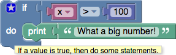
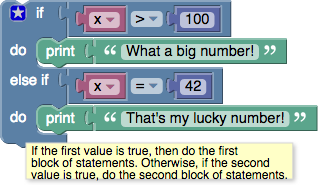

# **Logic Conditionals and Comparisons**
-----
Conditional statements are central to computer programming.  They make it possible to express statements like:

  * If there is a path to the left, turn left.
  * If score = 100, print "Well done!".

See [additional information about conditional statements](https://en.wikipedia.org/wiki/Conditional_(programming)).

## **If blocks**
>The simplest conditional statement is an **if** block, as shown:
>
>
>
>When run, this will compare the value of the variable **x** to 100.  If it is larger, "What a big number!" will be printed.  Otherwise, nothing happens.

## **If-Else blocks**
>It is also possible to specify that something should happen if the condition is _not_ true, as shown in this example:
>
>
>
>As with the previous block, "What a big number!" will be printed if **x** > 100; otherwise, "That's not very big." will be printed.
>
>An **if** block may have zero or one **else** sections but not more than one.

## **If-Else-If blocks**
>It is also possible to test multiple conditions with a single **if** block by adding **else if** clauses:
>
>
>
>The block first checks if **x** > 100, printing "What a big number!" if it is.  If it is not, it goes on to check if **x** = 42.  If so, it prints "That's my lucky number."  Otherwise, nothing happens.
>
>An **if** block may have any number of **else if** sections.  Conditions are evaluated top to bottom until one is satisfied, or until no more conditions are left.
>
## **If-Else-If-Else blocks**
>As shown here, **if** blocks may have both **else if** and **else** sections:
>
>
>
>The **else** section guarantees that some action is performed, even if none of the prior conditions are true.
>
>An **else** section may occur after any number of **else if** sections, including zero.

## **Block Modification**
>Only the plain **if** block appears in the toolbox:
>
>
>
>To add **else if** and **else** clauses, the user needs to click on the gear icon, which opens a new window:
>
>
>
>The user can then drag **else if** and **else** clauses into the **if** block, as well as reordering and removing them.  When finished, the user should click on the minus sign, which closes the window, as shown here:
>
>
>
>Note that the shapes of the blocks allows any number of **else if** subblocks to be added but only up to one **else** block.

## **Boolean**
>[Boolean algebra](https://en.wikipedia.org/wiki/Boolean_algebra) is a mathematical system that has two values:
>
>  * **true**
>  * **false**

>Boolean values (also called _conditions_) are used in these control block, which contain examples:

>  * [conditional blocks](Default_Logic.md)
>  * [repeat blocks](Default_Loops.md)

>One of the many examples from those pages is:

>

>If the value of the variable **x** is greater than 100, the condition is **true**, and the text "What a big number!" is printed.  If the value of **x** is not greater than 100, the condition is **false**, and "That's not very big." is printed.

>Boolean values can also be stored in variables and passed to procedures, the same as number, text, and list values.

>If a block expects a Boolean value as an input, it usually interprets an absent input as **false**.  An example is provided below.  Non-Boolean values cannot be directly plugged in where Boolean values are expected, although it is possible (but inadvisable) to store a non-Boolean value in a variable, then plug that into the input.  Neither of these practices are recommended, and their behaviour could change in future versions of Blockly.

## **Values**
>A single block, with a dropdown specifying either **true** or **false**, can be used to get a boolean value:
>
>

## **Comparisons**
>There are six comparison operators.  Each takes two inputs (normally numbers) and returns true or false depending on how the inputs compare with each other.
>
>
>
>The six operators are: equals, not equals, less than, less than or equal, greater than, greater than or equal.

## **Logical Operations**
>The **and** block will return **true** only if both of its two inputs are also true.
>
>
>
>The **or** block will return **true** if either of its two inputs are true.
>
>

## **Not**
>The **not** block converts its Boolean input into its opposite.  For example, the result of:
>
>
>
>is false.
>
>As mentioned above, if no input is provided, a value of **true** is assumed, so the following block produces the value **false**:
>
>
>
>Leaving an input empty is not recommended, however.

## **Questions?**
>Contact Boxlight Robotics at [support@BoxlightRobotics.com](mailto:support@BoxlightRobotics.com) with a detailed description of the steps you have taken and observations you have made.
>
>**Email Subject**: Blockly Logic
