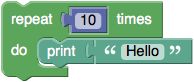

# **Blocks for Loop Creation**
-----
The **Control** category holds blocks that control whether other blocks placed in their **body** are run.  (For example, in the below "repeat" block, the body contains the "print" block and its input.)  There are two types of control blocks: [If-Else](Default_Logic.md) (described on their own page) and these, which control how many times the body is run and, in some cases, the value of a variable used within the body.  These structures are called **loops** since the body is repeated (possibly) multiple times, reminiscent of a rope containing loops.  Each pass through the loop is called an **iteration**.

## **Repeat**
>The simplest "repeat" block runs the code in its body the specified number of times.  For example, the following block will print "Hello!" ten times.
>
>

## **Repeat While**
>Imagine a game in which a player rolls a die and adds up all of the values rolled as long as the total is less than 30.  The following blocks implement that game:
>
  1. A variable named **total** gets an initial value of 0.
  1. The loop begins with a check that **total** is less than 30.  If so, the blocks in the body are run.
  1. A random number in the range 1 to 6 is generated (simulating a die roll) and stored in a variable named **roll**.
  1. The number rolled is printed.
  1. The variable **total** gets increased by **roll**.
  1. The end of the loop having been reached, control goes back to step 2.

>

>When the loop completes, any subsequent blocks (not shown) would be run.  In our example, the loop would end after some number of random numbers in the range 1 to 6 had been printed, and the variable **total** would hold the sum of these numbers, which would be guaranteed to be at least 30.

>For more information, see [while loop](https://en.wikipedia.org/wiki/While_loop).

## **Repeat Until**
>"Repeat while" loops repeat their bodies _while_ some condition is true.  Repeat-until loops are similar except that they repeat their bodies _until_ some condition is true.  The following blocks are equivalent to the previous example because the loop contains until **total** is greater than or equal to 30.

>

## **Count With**
>The **count with** block (called a [for loop](https://en.wikipedia.org/wiki/For_loop) in most programming languages) advances a variable from the first value to the second value by the increment amount (third value), running the body once for each value.  For example, the following program prints the numbers 1, 3, and 5.

>

>As shown by the two following loops, each of which prints the numbers 5, 3, and 1, the first input may be larger than the second.  The behavior is the same whether the increment amount (third value) is positive or negative.

>

## **For Each**
>The **for each** block (see [Foreach](https://en.wikipedia.org/wiki/Foreach)) is similar, except instead of giving the loop variable values in a numeric sequence, it uses the values from a list in turn.  The following program prints each element of the list: "alpha", "beta", "gamma".

>

# **Loop Termination Blocks**
-----
Most loops run until the terminating condition (in the case of  **repeat** blocks) is met or until all values have been taken by the loop variable (in the case of **count with** and **for each** loops).  Two rarely needed but occasionally useful blocks provide additional means for controlling loop behavior.  Although the below examples are for **for each** loops, they can be used with any type of loop.

## **Continue with next iteration**
>The **continue with next iteration** (called [continue](https://en.wikipedia.org/wiki/Control_flow#Continuation_with_next_iteration) in most programming languages) causes the remaining code in the body to be skipped and for the next iteration (pass) of the loop to begin.

>The following program prints "alpha" on the first iteration of the loop.  On the second iteration, the **continue with next iteration** block is run, skipping the printing of "beta".  On the final iteration, "gamma" is printed.

>

## **Break out of loop**
>The **break out of loop** block provides [an early exit from a loop](https://en.wikipedia.org/wiki/Control_flow#Early_exit_from_loops).  The following program prints "alpha" on the first iteration and "breaks out" of the loop on the second iteration when the loop variable is equal to "beta".  The third item in the list is never reached.

>

## **Questions?**
>Contact Boxlight Robotics at [support@BoxlightRobotics.com](mailto:support@BoxlightRobotics.com) with a detailed description of the steps you have taken and observations you have made.
>
>**Email Subject**: Blockly Loops