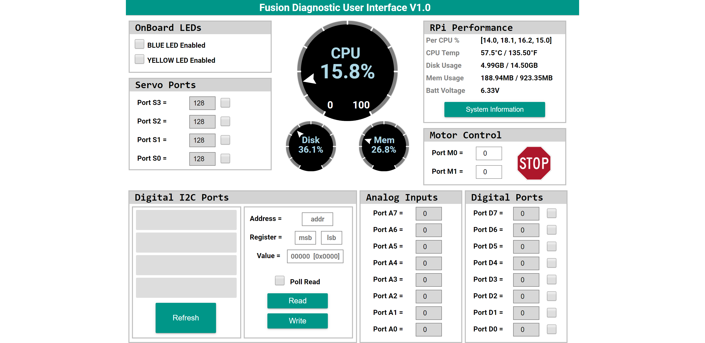

# **Diagnostic Tool**
-----
The Diagnostic Tool is very useful when trying to find important system information, test ports or sensors and retrieve valuable information that aids the support team in diagnosing the Fusion. In the event that you are having trouble with your Fusion our support team will ask for information gathered from the [**System Information**](Diagnostic_Tool.md#rpi-performance).  

This tool is also useful in identifying the behavior and initial values of sensors and servos instead of having to write example programs. Refer to the [Sensor Documentation](Sensor_Topic.md) for an explanation of testing sensors without the use of the Blockly or Python libraries.

## **RPi Performance**
>Here you will get important information about the current condition of the internal Raspberry Pi. The gauges represent some information in the RPi Performance box as a percentage.  
>**CPU** calculates the overall processor usage from all 4 cores of the processor. In the box the processor usage is displayed per core.  
>**Disk** represents the Disk Usage as a percentage to better see how much space you have available on the SD card.  
>**Mem** represents the available random access memory on the Raspberry Pi. This is used to store data that is currently being used to run the operating system and any programs or processes.  
>**Battery Voltage** displays the current voltage of the 6V battery. At full charge the battery is at a voltage of approximately 6.4V.  
>  
>Clicking the **System Information** button opens a screen that displays useful information that can be used when communicating with the support team. If more information is requested from the support team, click **Full Support Diagnostic Download** to download a .zip file. Email this .zip file to [support@BoxlightRobotics.com](mailto:support@BoxlightRobotics.com) with the subject **Fusion Diagnostic Support Files**.  
>  

## **OnBoard LEDs**  
>On the Fusion there are 2 [user controlled LEDs](On_Board_LED.md). By checking the box the corresponding LED will turn on. uncheck the box to turn the LED off.  
>

## **Servo Ports**
> There are 4 [Servo Ports](Servo_Ports.md) on the Fusion. Checking the check box enables the servo port by supplying power to the connected servo. The port must be enabled in order change values within the box next to it. You can send the servo port a value between **0** to **255** to move its full range. Uncheck the box to disable the selected servo port and no longer supply power to the connected servo.  
>

## **Motor Control**
>There are 2 DC [Motor Ports](Motor_Ports.md) on the Fusion. Each port can take a value between **-100** to **100**. Enter a value of **0** to stop the selected motor or click the  button to immediately stop both motor ports.  
>

## **Analog Inputs**
>There are 8 [Analog Ports](Analog_Ports) for reading analog inputs. The returned value from an analog port ranges from **0** to **1024**. You may notice that the value in the next port may increase if no sensor is attached. This is because it is a floating input. Once another sensor is connected to that port the value will not be manipulated by the previous port.  
>

## **Digital Ports**
>There are 8 [Digital Ports](Digital_Ports.md) for reading from or writing to a digital sensor. By default the ports are in read mode which will read inputs from digital sensors as either a **0** or **1**. Checking the check box changes the port to write mode. Then a value of **0** or **1** can be written to the attached device.  
>

## **Digital I2C Ports**
>There are 4 [I2C Ports](I2C_Ports.md) connected to a single I2C Bus on the Fusion. The first step to take when using this section is to click **Refresh** on the bottom left. This will populate the list on the left with the connected I2C sensors and their addresses. For a list of sensors and their I2C registers refer to the [Sensor Documentation](Sensor_Topic.md).  
>In the first example the Fusion is reading from an Integrating Gyro with address **0x20**. The heading data for this sensor is 2 Bytes long, therefore **0x04** is entered into the *lsb* and **0x05** is entered into the *msb*. This will take the values from both registers and concatenate them together. Clicking the **Read** button will return the current register value to the *Value* field. There are times where it is more efficient to constantly read from the port. To do this, check the **Poll Read** check box and the *Value* field will be constantly updated with the value read from the registers.  
>To read from a single register, only enter the register location into the *lsb* field.  
>  
>In this next example the Fusion is writing to the Color Beacon with address **0x4c**. Writing to the Color Number(**0x04**) register by putting the register location into the *lsb* field. Next, a value of **4** is entered into the *Value* field to produce the color blue. Clicking read will write the *Value* to the *Register*.   
>  

## **Change I2C Address**
>Changing the I2C address is very important when using two of the same I2C sensors on the same I2C bus. For both sensors to work they must have different I2C address, otherwise they will both communicate at the same time causing garbage data to be returned.  
>With only **1** of the sensors connected, follow the instructions below to change the I2C address.

><table style="width:95%" align="center">
    <tr><th style="width:26%">
**1.** Click the sensor name to change the I2C address.
</th><th style="width:48%">
**2.** Follow the on-screen insturctions to change the I2C address of the selected sensor. Click **OK** to set the new address to the sensor.
</th><th style="width:26%">
**3.** Click **Refresh** to update the sensor list with the new address.
</th></tr>
    <tr><td>

</td><td></td><td>

</td></tr>
</table>

## **Questions?**
>Contact Boxlight Robotics at [support@BoxlightRobotics.com](mailto:support@BoxlightRobotics.com) with a detailed description of the steps you have taken and observations you have made.
>
>**Email Subject**: Fusion Diagnostic Tool