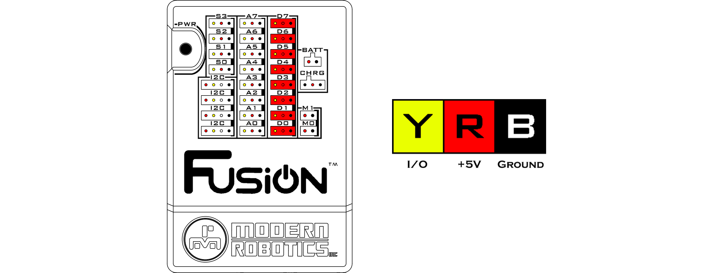

# **Digital Ports**
-----
There are 8 digital ports for controlling digital sensors that are either **ON** (**1**) or **OFF** (**0**). Each port consists of a black, red and yellow wire connection. The black wire is the ground wire and must line up with the black bar on the right side of the port. The red wire is the power wire that connects to 5V for all the sensors to operate on. The yellow wire is the logic voltage line that ranges from 0V-5V and it is used to send or receive signal. 

>**Current Limiting Resistor** : 220ohm  
>**Signal Logic Levels** : 5V TTL at 22mA Max  
>**Ports** : D0 - D7  
>[Blockly Programming Reference](Blk_Analog_Digital.md#digital-read)  
>[Python Programming Reference](Py_Driver.md#digitalreadport)

## **Questions?**
>Contact Boxlight Robotics at [support@BoxlightRobotics.com](mailto:support@BoxlightRobotics.com) with a detailed description of the steps you have taken and observations you have made.
>
>**Email Subject**: Fusion Digital Ports