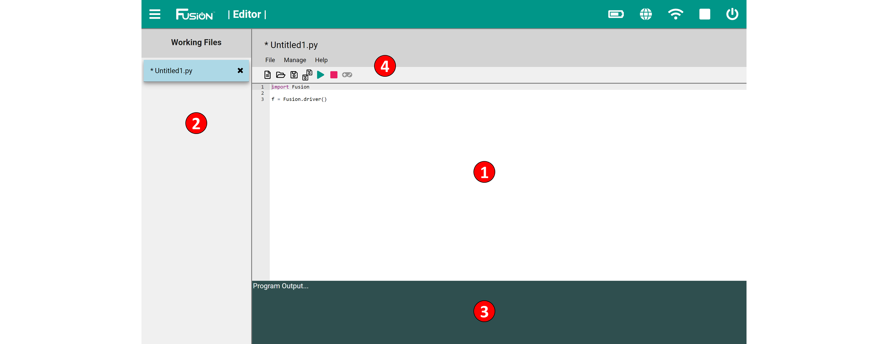

# **Editor Reference**
-----
The Editor is a web-based Integrated Development Environment (IDE) targeted to more advanced users. The programming language Fusion currently supports is Python, but will soon support other languages.  

A basic understanding of text-based coding and the syntax for the selected programming language is needed to use the Editor IDE.  

>1) **Program Environment**
>>* This is the space which contains the user code. This space supports syntax highlighting for the selected language.
>
>2) **Working Files**
>>* Contains a list of open files. Files can be easily switched between without any loss of data. A * next to s file name indicated that it has not been saved.
>
>3) **Program Output** 
>>* Displays the output of the program generated using the print statement or an error from the Controller.
>
>4) **Toolbar**
>>* **File Name** - The name of the file that is selected in the Working Files and open in the Program Environment.
>>* **File** - Gives the option to Create, Open, Close, Save, Delete and Print a file.
>>* **Manage** - Import or Export a file.
>>* **Help** - Access controller and sensor examples as well as a link to the documentation.
>>
>>* **New File** - Opens a new file with Fusion import and driver lines in code.
>>* **Open File** - Open a file that exists in the current user's file directory.
>>* **Save File** - Save the current file that is highlighted in Working Files.
>>* **Save All Files** - Save all the current files the Working Files.
>>* **Run Program** - Run the current program that is highlighted in Working Files.
>>* **Stop Program** - Stop the current running program.
>>* **Open Virtual Gamepad** - Open the Virtual Gamepad in a new tab. (Must run the program first)

## **Use Guide**
>**1. [Create a program](Editor.md)**  

## **Python Library Reference**

>The Fusion Python Library was developed by Boxlight Robotics engineers to control the Fusion Controller, motors, servos and our sensors. All available functions are documented and explained thoroughly in this document. Fusion uses Python 2.7.
>>**1. [Constants](Py_Constants.md)**  
>>**2. [Fusion Driver](Py_Driver.md)**  
>>**3. [Motor Control](Py_Motors.md)**  
>>**4. [Servo Control](Py_Servos.md)**  
>>**5. [USB Gamepad](Py_usbGamepad.md)**  
>>**6. [Virtual Gamepad](Py_VirtualGamepad.md)**  
>>**7. [Compass (45-2003)](Py_Compass.md)**  
>>**8. [Rate Gyro (45-2004)](Py_Rate_Gyro.md)**  
>>**9. [Integrating Gyro (45-2005)](Py_Integrating_Gyro.md)**  
>>**10. [Optical Distance Sensor (45-2006)](Py_Optical_Distance_Sensor.md)**  
>>**11. [Touch Sensor (45-2007)](Py_Touch_Sensor.md)**  
>>**12. [Range Sensor (45-2008)](Py_Range_Sensor.md)**  
>>**13. [Infrared Locator 360° (45-2009)](Py_IR_Locator_360.md)**  
>>**14. [Light Sensor (45-2015)](Py_Light_Sensor.md)**  
>>**15. [Sound Generator (45-2016)](Py_Sound_Generator.md)**  
>>**16. [Infrared Seeker V3 (45-2017)](Py_IR_Seeker_V3.md)**  
>>**17. [Color Sensor (45-2018)](Py_Color_Sensor.md)**  
>>**18. [Color Beacon (45-2019)](Py_Color_Beacon.md)**  
>>**19. [Magnetic Sensor(45-2020)](Py_Magnetic_Sensor.md)**  