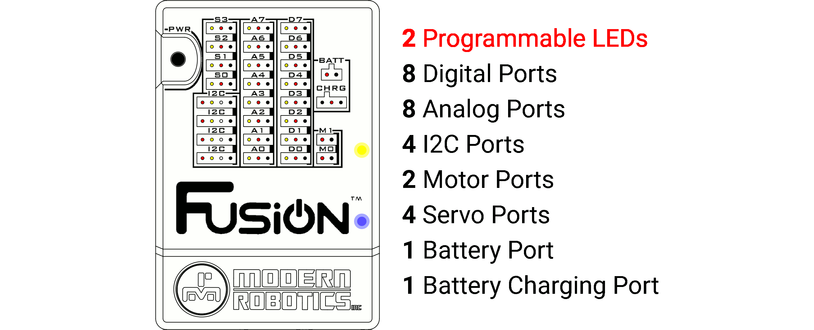

# **Fusion Controller Reference**
-----
The Fusion Controller is an intelligent backpack board combined with the power of the Raspberry Pi 3, built into a robust and durable housing. The Fusion comes with a wide assortment of ports capable of supporting motors, servos and various types of sensors.    
Connect to the Fusion with a web browser on any device that has Wi-Fi. Program the robot using a visual block programming environment called [Blockly](Blockly.md), or test your skills in programming languages such as Python in our [Editor](Editor.md) environment.

## **How To:**
>**1. [Connect to USB Power](Connect_USB_Power.md)**  
>**2. [Connect to Battery Power](Connect_Battery.md)**  
>**3. [Charge the Fusion Battery](Charge_Battery.md)**  
>**4. [Power the Fusion On](Power_On.md)**  
>**5. [Power the Fusion Off](Power_Off.md)**  
>**6. [Restore the Fusion Access Point](AP_Restore.md#restore-ssid-and-passkey-via-the-system-recovery-wire)**  

## **Controller Layout:**
>
>
>The programmable Fusion Controller includes connection ports for a wide variety of motors, sensors, servos and devices.  This section outlines the basic features of the Fusion Controller and provides detailed programming and reference information to help you use each of the different ports in your designs.
>
>**More Information:** 
>>**1. [OnBoard LEDs](On_Board_LED.md)**  
**2. [Digital Ports](Digital_Ports.md)**  
**3. [Analog Ports](Analog_Ports.md)**  
**4. [I2C Ports](I2C_Ports.md)**  
**5. [Motor Ports](Motor_Ports.md)**  
**6. [Servo Ports](Servo_Ports.md)**  
**7. [Battery Port](Connect_Battery.md)**  
**8. [Battery Charger Port](Charge_Battery.md)**  
**9. [USB Power Port](Connect_USB_Power.md)**  
**10. [Power Button ON](Power_On.md)**  
**11. [Power Button OFF](Power_Off.md)**  
**12. [USB Hub](USB_Hub.md)**  
**13. [Ethernet Port](Ethernet_Port.md)**  
**14. [Wi-Fi](WiFi_Hub.md)**  
**15. [SD Card](SD_Card.md)**  

