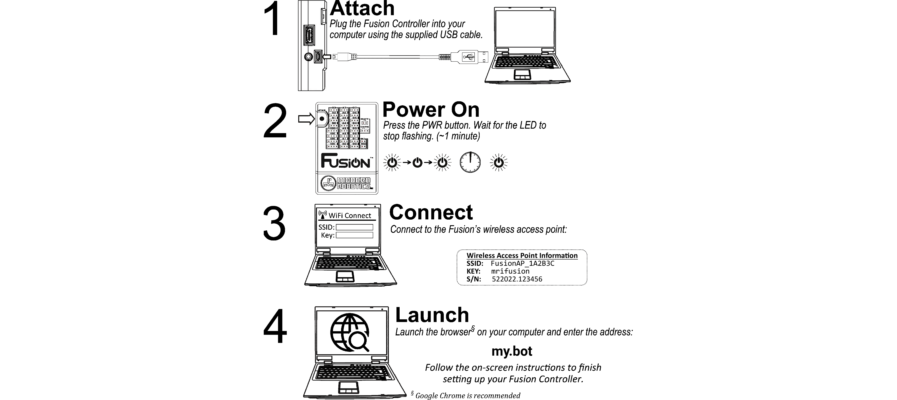

# **Getting Started**
-----
The Fusion Controller is the heart of your MyBot System, and is fully loaded with all the applications, tools, resources, and documentation you need.  

To get started, you will want to connect the browser on your Wi-Fi enabled device to the Fusion's built-in wireless access point so you can log in and access all the built-in documentation.

In the event that you need a little help getting started, here’s some basic guidance:

## **Step-by-Step**
**Step 1: Attach** - The brain inside Fusion Controller can be powered from a USB port on your computer using the supplied cable.  You will see a green LED near the microUSB power input connector light-up when power is applied. *Note that this provides power to the internal electronics and does not provide power for motors, servos, and other devices you may connect to your Fusion Controller.  These are only powered directly from the Battery Pack.*

**Step 2: Power On** - A press of the PWR button will turn on your Fusion Controller and start the internal boot-up process.  The Green LED near the letter O in Fusi**o**n will flash while the unit starts.  It will light solid once the system is done with the start up process.

**Step 3: Connect** - Connect your Wi-Fi enabled device to the Fusion's internal access point.  The access point will appear as **FusionAP_ xxxxxx**, where **xxxxxx** is a unique identifier for your particular Fusion.  This value can be found on the inside lid of the Fusion Controller Kit's box, or on a label attached to the side or bottom of the Fusion Controller.  The case-sensitive Passkey is **mrifusion**.  (**Note:** *These credentials are the default values for your Fusion.  Your Admin user may have changed them to simplify robot identification.  If there is not a FusionAP_xxxxxx Wi-Fi signal, check with your your Robot Admin User to see if there are other credentials to use.*)

**Step 4: Launch** - Open the browser on your device and browse to the Address/URL **my.bot** to access the Fusion Interface.  This will open the Fusion Login screen where you can login to your account (or create a new one).  You can also login as a *Guest User* to get quick access to the complete Fusion Documentation Suite.  (**Note:** *If you have an active wired internet connection to your computer, the my.bot URL will not work.  You must enter the following address: http://192.168.50.1:8080 to access the Fusion Interface.*)

### These topics may help you get started with your Fusion. ###
>**1. [Connect USB Power](Connect_USB_Power.md)**  
>**2. [Connect Battery Power](Connect_Battery.md)**  
>**3. [Find/Connect Fusion Access Point](AP_Find.md)**  
>**4. [Accessing the Fusion Web Interface](Accessing_Web_Interface.md)**  
>**5. [Create a new account](Account_Create.md)**  
>**6. [Assembling your MyBot Kit](Robot_Building_Topic.md)**  
>**7. [Create a Blockly Program](Blockly.md)**  
>**8. [Create an Editor Program](Editor.md)**  

## **Troubleshooting**
>**Step 1: [Green LED does not light when connecting microUSB cable](Trouble_Step1.md)**  
>**Step 2: [Fusion will not turn on](Power_On.md)**  
>**Step 2: [Status LED does not stop flashing](Power_On.md#what-if-it-doesnt-stop-blinking)**  
>**Step 3: [Can't find the Fusion Access Point](Trouble_Step3.md)**  
>**Step 4: [Cannot access Fusion Interface](Trouble_Step4.md)**  

### Additional Assistance ###
- **[Missing items from your MyBot Kit](Missing_Items.md)**  

If you need additional assistance, please email us at Support@BoxlightRobotics.com.

