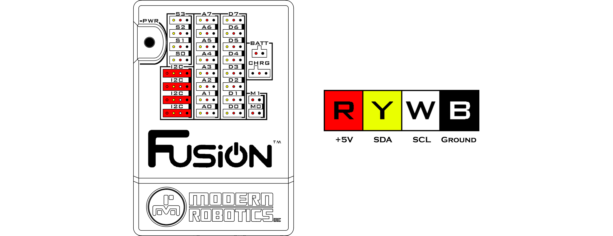

# **I2C Ports**
-----
There are 4 Inter-Integrated Circuit (I2C) ports for controlling I2C sensors. An I2C sensor uses addresses, registers and commands to read and write data.  

Each sensor has its own I2C address associated with it. If two of the same sensor are to be used together, the I2C address of one sensor must be changed first. The I2C ports on the Fusion are all connected to the same I2C bus. Therefore, the I2C port that the sensor is connected to is arbitrary.  

Each sensor has its own object declaration that must be called at the beginning of user code. The object declaration name is arbitrary and an object declaration must be called for each sensor being used. If there are two of the same sensors, the declaration must be called twice and they must have different names.  

>**Power** : 5V DC  
>**Pull-up Resistor** : 47k ohm  
>**Series Resistor** : 47 ohm  
>**Signal Logic Levels** : 5V TTL  
>**I2C Bus Speed** : 100kHz  
>**Ports** : I2C  

>[Python Programming Reference](Py_Driver.md#i2creadaddr-reg-len)

## **Questions?**
>Contact Boxlight Robotics at [support@BoxlightRobotics.com](mailto:support@BoxlightRobotics.com) with a detailed description of the steps you have taken and observations you have made.
>
>**Email Subject**: Fusion I2C Ports