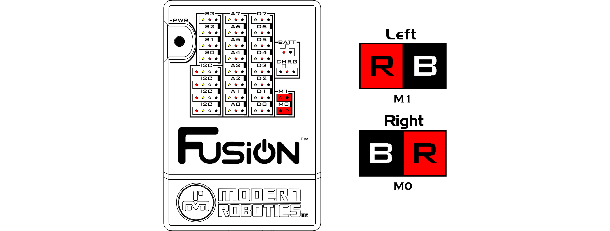

# **Motor Ports**
-----
There are 2 motor ports for controlling 6V DC motors. Connecting the motors in reverse polarity will switch the direction of motor rotation and will not cause any damage to the controller or the motors.

>**Power** : 6V DC  
>**Current Limit** : 1.5A max  
>**Operation Frequency** : 800Hz PWM  
>**Stop Modes** : Float / Brake  
>**Ports** : M0 - M1  
>[Blockly Programming Reference](Int_Motors.md)  
>[Python Programming Reference](Py_Motors.md)

The connection depicted above is the default motor connection configuration for the Fusion Controller. If your motors are not connected in this manner, any examples that use motors may not work correctly.

## **Questions?**
>Contact Boxlight Robotics at [support@BoxlightRobotics.com](mailto:support@BoxlightRobotics.com) with a detailed description of the steps you have taken and observations you have made.
>
>**Email Subject**: Fusion Motor Ports