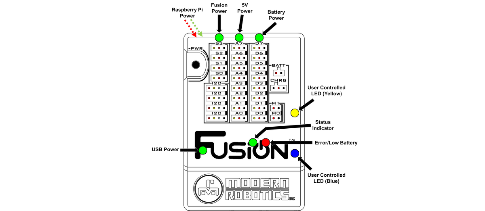

# **OnBoard LEDs**
-----

>>**Raspberry Pi Power**  

>>* These LEDs indicate power to the Raspberry Pi 3.  

>>**Fusion Power** 

>>* This indicates the Fusion is powered on and running.

>>**5V Power** 

>>* This indicates the 5V circuitry is enabled.

>>**Battery Power** 

>>* This indicates that the battery is connected and the 6V circuitry is enabled.

>>**Status Indicator** 

>>* The status LED indicated the current state the Fusion is in.
>>>* If the LED is **OFF**, then the Fusion is off.
>>>* If the LED is **BLINKING**, then the Fusion is booting up and will be ready for use once the light is solid.
>>>* If the LED is **ON** and solid, then the Fusion is ready to use.

>>**Error/Low Battery** 

>>* This LED will blink when the battery has approximately 20% battery life remaining.

>>**USB Power** 

>>* This LED is turn on when connected to a USB power source.

>>**User Controlled LEDs** 

>>* These LEDs can be programmed by the user from both [Blockly](Int_Fusion-Control.md#led)([Basic](Basic_Fusion-Control.md#blue-led-on)) and the [Editor](Py_Driver.md#setledled-value) to turn **ON** and **OFF**.

## **Questions?**
>Contact Boxlight Robotics at [support@BoxlightRobotics.com](mailto:support@BoxlightRobotics.com) with a detailed description of the steps you have taken and observations you have made.
>
>**Email Subject**: Fusion LEDs