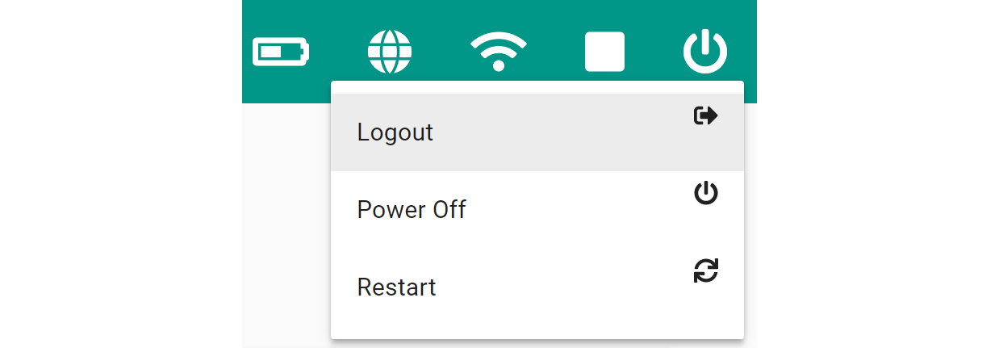

# **Power down the Fusion**
-----
## **Shutdown the Fusion with the on-board power button (PWR)**

>(**Soft Shutdown**)  
>> The recommended method to power off the Fusion is to press the power button once when the Status LED is solid. This will send the power off command to the RaspberryPi and safely power down the Fusion.  

>(**Hard Shutdown**) 
>>The second method to power off the Fusion is to hold down the power button for 4 seconds until the power LED turns off. This can be done at any time, however does not safely shutdown the Fusion and should only be used if the **soft shutdown** did not work.
>

## **Powering down the Fusion with the web interface.**
>There is also an option to power the Fusion down within the web interface.
>>1. Go to the top right corner of the Fusion Web Interface
>>2. Select the power icon on the right.
>>3. Select one of the following options:  
>>>* **Logout** - Exit the current user account.  
>>>* **Power Off** - Safely power down the Fusion.  
>>>* **Restart** - Power down the Fusion and immediately power back on.

>>**Power Off** and **Restart** will disconnect your computer from the Fusion Access Point.
>

## **Questions?**
>Contact Boxlight Robotics at [support@BoxlightRobotics.com](mailto:support@BoxlightRobotics.com) with a detailed description of the steps you have taken and observations you have made.
>
>**Email Subject**: Fusion Power Down