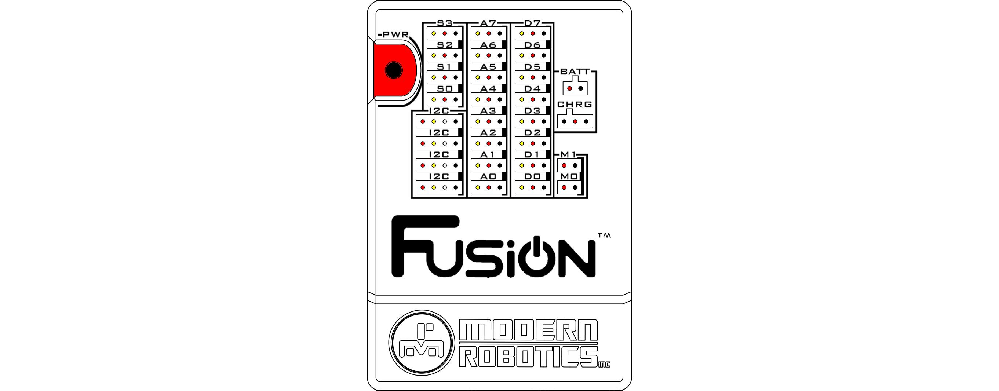
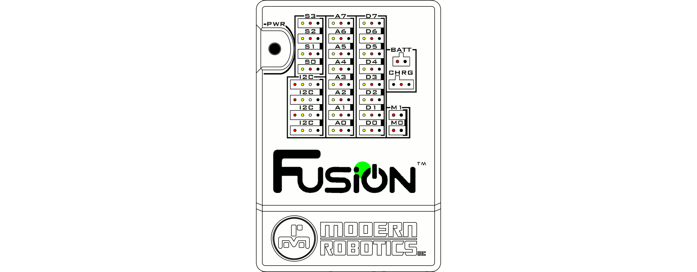

# **Power the Fusion on**
-----
## **Fusion Power Button (PWR)**
>First, check to see that you have power connected to either [USB](Connect_USB_Power.md) or an approved [6V Battery](Connect_Battery.md).  
>Simply pressing the power button will cause the LEDs on board to flash, but not turn the Fusion on. The power button must be held down for 2 sec in order to turn on the power and start the system.

>Once powered on, a green LED under the Fusion logo will start flashing while the system boots up. This process takes approximately 30 seconds.  
>When the LED stays solid, the systems is ready for use.

## **What if it doesn't stop blinking?**
>If the Fusion was recently updated, it may take up to 2 minutes for the system boot up process to complete.  
>If the LED continues to blink, [power off](Power_Off.md) the Fusion by holding down on the power button until the power LED turns off. Wait a few seconds, before pressing the power button to turn the Fusion back on.

## **Questions?**
>Contact Boxlight Robotics at [support@BoxlightRobotics.com](mailto:support@BoxlightRobotics.com) with a detailed description of the steps you have taken and observations you have made.
>
>**Email Subject**: Fusion Power Issue