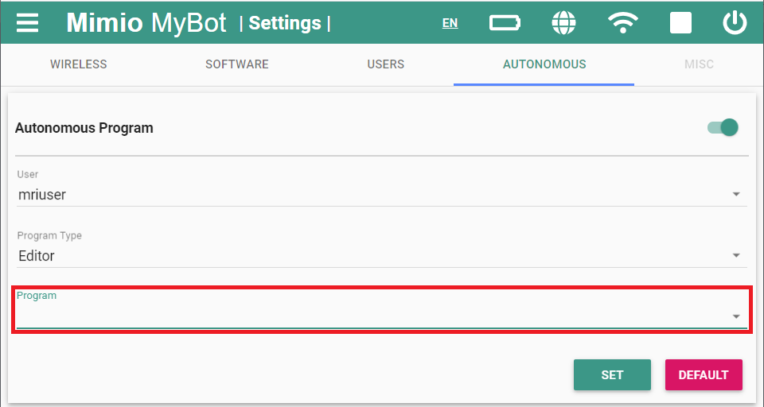

# **Autonomous Mode**
-----

Autonomous mode allows an administrator to select a program on the Fusion to run automatically
when the Fusion powers on.

>A user must be logged in as an **administrator** to access the appropriate settings.

## Location:

>1. Open the Fusion settings from the hamburger menu on the left or the settings box on the home page.
>

>2. Navigate to the **AUTONOMOUS** tab option
>

## Toggle Autonomous Mode

>Autonmous mode can be toggled on and off by enabling the switch on the upper right hand corner.
>

## Setting a Program

>1. Select a user account
>

>2. Select a program type (at the time of writing this documentation, only editor programs are supported)
>

>3. Select a program
>

>4. Press set
>

## Resetting to Default Mode

>Autonomous mode can be reset to it's factory settings by pressing the default button.
>

## **Questions?**

>Contact Boxlight Robotics at [support@BoxlightRobotics.com](mailto:support@BoxlightRobotics.com) with a detailed description of the steps you have taken and observations you have made.
>
>**Email Subject**: Fusion Autonomous Mode