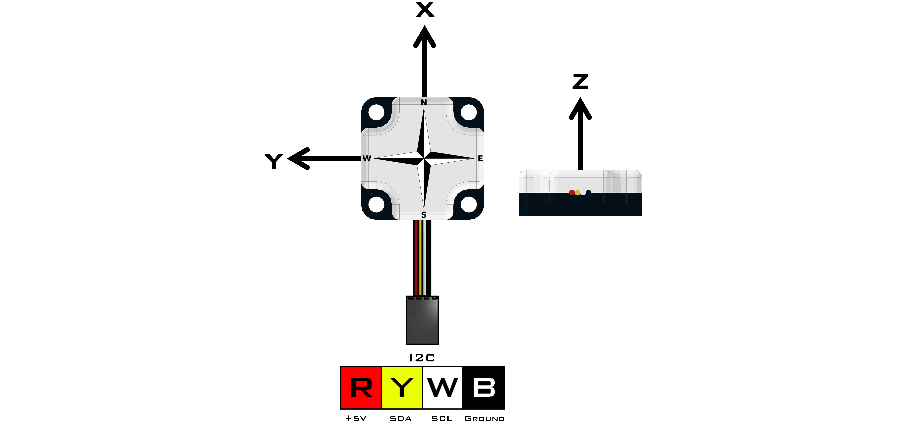
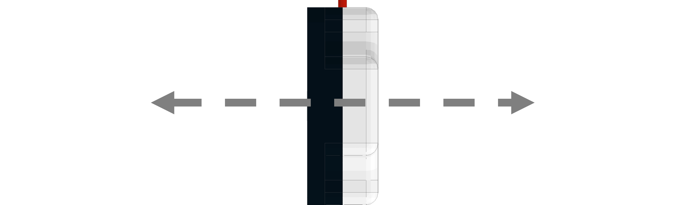

# **Compass (45-2003)**
-----
The Compass uses a magnetometer and an accelerometer to calculate heading data based on Earth’s magnetic field. The compass can return the heading data, accelerometer data and magnetometer data to the user. Anything that generates a magnetic field must be moved away from the sensor like power cables, motor or magnetic material. This must happen because during calibration the sensor will add an offset to account for other magnetic sources in the area.

>**Sensor Type** : Four Wire I2C  
>**Default I2C Address** : 0x24  
>**Sensor ID Code** : 0x63  
>**Dimensions** : 32mm x 32mm x 12mm  
>**Mounting Holes** : 24mm x 24mm  
>**Power** : 5V DC, 22mA Max  
>**Signal Logic Levels** : Logic 0 - 0V, Logic 1 - 5V  
>**I2C Bus Speed** : 100kHz max  
>**I2C Address Change Option** : Yes (Even Number 0x10 - 0xEE)  
>[Compass Visual Programming Blocks](Blk_Compass.md)

**List of available functions:**  

* [**Fusion.compass(*driver*, *addr*)**](Py_Compass.md#fusioncompassdriver-addr)
* [**hardIronCalibration()**](Py_Compass.md#hardironcalibration)
* [**getHeading()**](Py_Compass.md#getheading)
* [**nullAccelerometer(*axis*)**](Py_Compass.md#nullaccelerometeraxis)
* [**getAccelerometer()**](Py_Compass.md#getaccelerometer)
* [**tiltUp()**](Py_Compass.md#tiltup)
* [**tiltDown()**](Py_Compass.md#tiltdown)
* [**getMagnetometer()**](Py_Compass.md#getmagnetometer)
* [**scaleAccelerometer())**](Py_Compass.md#scaleaccelerometer)

## **Fusion.compass(*driver*, *addr*)**
>### Definition
>>This class contains the necessary drivers for our Compass and must be called at the beginning of the program before using any other class functions. 
>
>### Parameters
>>***driver*** : Main driver object so the class can call driver functions (**f**)  
>>***addr*** : Enter an I2C address in hexadecimal if different from default 
>
>### Returns
>>**Compass Object**
>
>### Example
>>
    import Fusion
    f = Fusion.driver()
    cmp1 = Fusion.compass(f)
    cmp2 = Fusion.compass(f, 0x40)

## **hardIronCalibration()**
>### Definition
>>Hard Iron Calibration (HIC) is a method of checking for magnets or an object generating a magnetic field around the sensor and generating an offset to account for the magnetic field. During HIC the sensor must be rotated 360° in 5 seconds while keeping a constant pace. Try to start and stop the sensor pointing due North. 
>
>### Parameters
>>**None**
>
>### Returns
>>**None**
>
>### Example
>>
    import Fusion
    f = Fusion.driver()
    cmp = Fusion.compass(f)
    cmp.hardIronCalibration()
    
## **getHeading()**
>### Definition
>>This function returns the heading that ranges between 0° and 359°. The heading is calculated from the accelerometer readings, the magnetometer readings, and the data collected during calibration.
>
>### Parameters
>>**None**
>
>### Returns
>>***Heading(Degrees)*** : int (0 - 359)
>
>### Example
>>
    import Fusion
    f = Fusion.driver()
    cmp = Fusion.compass(f)
    print cmp.getHeading()
    
## **nullAccelerometer(*axis*)**
>### Definition
>>This function will calibrate the **X**, **Y** and **Z** values by zeroing them. The **X** and **Y** calibration must be done with the sensor laying flat on the horizon. The **Z** must be calibrated with the sensor held vertical. Allow a minimum of 3 seconds for calibration.
>>
>>Position for **X** and **Y** axis.
>>
>>
>>
>>Position for **Z** axis.
>>
>>
>
>### Parameters
>>***axis*** : char ( 'X' , 'Y' , 'Z')
>
>### Returns
>>**None**
>
>### Example
>>
    import Fusion
    f = Fusion.driver()
    cmp = Fusion.compass(f)
    cmp.nullAccelerometer('X')
    cmp.nullAccelerometer('Y')
    cmp.nullAccelerometer('Z')
    
## **getAccelerometer()**
>### Definition
>>This function returns the accelerometer values for the **X**, **Y** and **Z** axis.
>
>### Parameters
>>**None**
>
>### Returns
>>***Accelerometer*** : int [ **X** , **Y** , **Z** ] (-32,767 - 32,768)
>
>### Example
>>The following example returns an array of size **3** and stores it into the variables **X**, **Y**, and **Z**.
>>
    import Fusion
    f = Fusion.driver()
    cmp = Fusion.compass(f)
    (X, Y, Z) = cmp.getAccelerometer()
    print X
    
>>To collect a single value instead of the array, reference the index. This will print the **X** value.
>>
    import Fusion
    f = Fusion.driver()
    cmp = Fusion.compass(f)
    print cmp.getAccelerometer()[0]
    
## **tiltUp()**
>### Definition
>>This function calculates an offset to compensate for the magnetic field not being perfectly horizontal. The sensor must be held 20° above the horizon during calibration.
>>
>>
>
>### Parameters
>>**None**
>
>### Returns
>>**None**
>
>### Example
>>
    import Fusion
    f = Fusion.driver()
    cmp = Fusion.compass(f)
    cmp.tiltUp()
    
## **tiltDown()**
>### Definition
>>This function calculates an offset to compensate for the magnetic field not being perfectly horizontal. The sensor must be held 20° below the horizon during calibration.
>>
>>
>
>### Parameters
>>**None**
>
>### Returns
>>**None**
>
>### Example
>>
    import Fusion
    f = Fusion.driver()
    cmp = Fusion.compass(f)
    cmp.tiltDown()
    
## **getMagnetometer()**
>### Definition
>>This function returns the values of the magnetometer on the **X**, **Y** and **Z** axis.
>
>### Parameters
>>**None**
>
>### Returns
>>***Magnetometer*** : int [ **X** , **Y** , **Z** ] (0 - 1023)
>
>### Example
>>The following example returns an array of size **3** and stores it into the variables **X**, **Y**, **Z**.
>>
    import Fusion
    f = Fusion.driver()
    cmp = Fusion.compass(f)
    (X, Y, Z) = cmp.getMagnetometer()
    print X
    
>>To collect a single value instead of the array, reference the index. This will print the **X** value.
>>
    import Fusion
    f = Fusion.driver()
    cmp = Fusion.compass(f)
    print cmp.getMagnetometer()[0]
    
## **scaleAccelerometer()**  
>### Definition
>>This function is called if the user wants to change the sensitivity of the accelerometer reading. First the sensor must be set vertical (Same position as **Z** calibration) and hold it there for the duration of the calibration. Once the sensor is in position the program may be ran. Once the program is completed, the scaling value will be updated within the Compass.
>>
>>Postion of sensor during scaling.
>>
>>
>
>### Parameters
>>**None**
>
>### Returns
>>**None**
>
>### Example
>>
    import Fusion
    f = Fusion.driver()
    cmp = Fusion.compass(f)
    cmp.scaleAccelerometer()

## **Questions?**
>Contact Boxlight Robotics at [support@BoxlightRobotics.com](mailto:support@BoxlightRobotics.com) with a detailed description of the steps you have taken and observations you have made.
>
>**Email Subject**: Fusion Python Compass