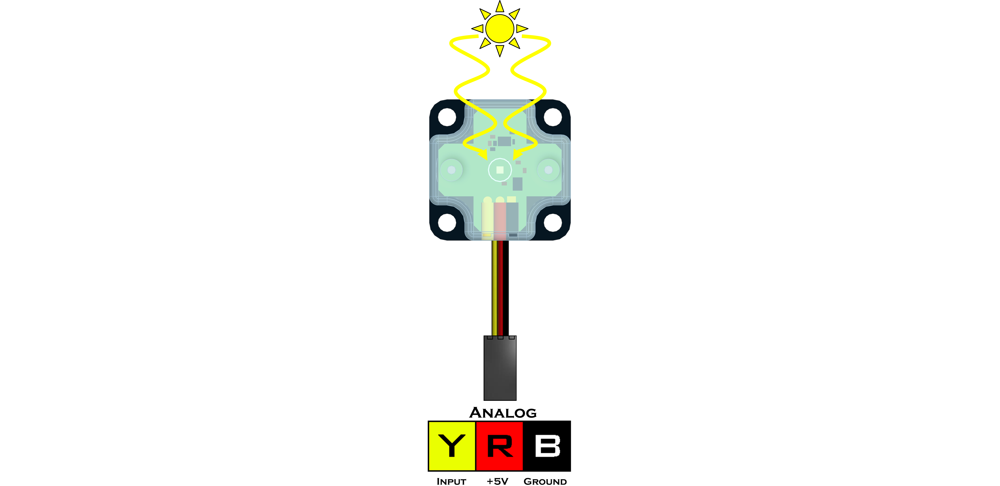

# **Light Sensor (45-2015)**
-----
The Light Sensor detects the ambient light level using a phototransistor. The value returned is a quasi-logarithmic analog value. This means that the Light Sensor can detect slight changes in light and dark environments. A value of 0 indicates no light and a value of 1023 indicates the sensor is flooded with light.

>**Sensor Type** : Three Wire Analog  
>**Dimensions** : 32mm x 32mm x 12mm  
>**Mounting Holes** : 24mm x 24mm  
>**Power** : 5V DC, 22mA Max  
>**Signal Logic Levels** : Analog 0V - 5V  
>[Light Sensor Visual Programming Blocks](Blk_Light_Sensor.md)

**List of available functions:**  

* [**Fusion.analog(*driver*, *port*)**](Py_Light_Sensor.md#fusionanalogdriver-port)
* [**read()**](Py_Light_Sensor.md#read)

## **Fusion.analog(*driver*, *port*)**
>### Definition
>>The following class provides a wrapper for the analog function to tie sensor names directly to the port and read all in one simple motion. 
>
>### Parameters
>>***driver*** : Main driver object so the class can call driver functions (**f**)  
>>***port*** : Analog port the sensor is connected to A0 - A7
>
>### Returns
>>**Analog Object**
>
>### Example
>>
    import Fusion
    f = Fusion.driver()
    light_A0 = Fusion.analog(f, f.A0)
    
## **read()**  
>### Definition
>>Returns the current analog value read on the sensor.
>>
>>* Idle value changes depending on the amount of ambient light in the environment.
>
>### Parameters
>>**None**
>
>### Returns
>>***Ambient Light*** : int (0 - 1023)
>
>### Example
>>
    import Fusion
    f = Fusion.driver()
    light_A0 = Fusion.analog(f, f.A0)
    print light_A0.read()

## **Questions?**
>Contact Boxlight Robotics at [support@BoxlightRobotics.com](mailto:support@BoxlightRobotics.com) with a detailed description of the steps you have taken and observations you have made.
>
>**Email Subject**: Fusion Python Light Sensor