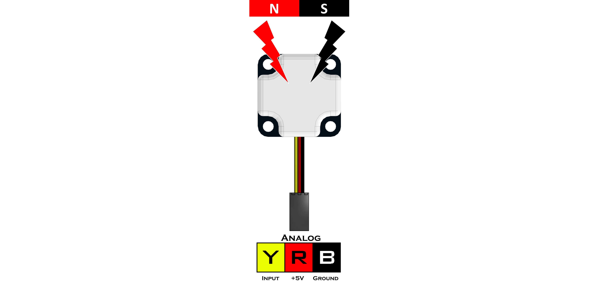

# **Magnetic Sensor (45-2020)**
-----
The Magnetic Sensor detects a magnetic field and returns the strength based on the distance between the sensor element and the magnet. The default returned by the sensor when no magnetic field is present is approximately 340. When the returned value is increasing, the sensor is detecting the "North Pole" of the magnet. If the value returned is decreasing, then the sensor is detecting the "South Pole" of the magnet.

>**Sensor Type** : Three Wire Analog  
>**Dimensions** : 32mm x 32mm x 12mm  
>**Mounting Holes** : 24mm x 24mm  
>**Power** : 5V DC, 22mA Max  
>**Signal Logic Levels** : Analog 0V - 5V  
>[Magnetic Sensor Visual Programming Blocks](Blk_Magnetic_Sensor.md)

**List of available functions:**  

* [**Fusion.analog(*driver*, *port*)**](Py_Magnetic_Sensor.md#fusionanalogdriver-port)
* [**read()**](Py_Magnetic_Sensor.md#read)

## **Fusion.analog(*driver*, *port*)**    
>### Definition
>>The following class provides a wrapper for the analog function to tie sensor names directly to the port and read all in one simple motion. 
>
>### Parameters
>>***driver*** : Main driver object so the class can call driver functions (**f**)  
>>***port*** : Analog port the sensor is connected to A0 - A7
>
>### Returns
>>**Analog Object**
>
>### Example
>>
    import Fusion
    f = Fusion.driver()
    mag_A0 = Fusion.analog(f, f.A0)
    
## **read()**  
>### Definition
>>Returns the current magnetic intensity in the North or South direction.
>>
>>* Value of 340 indicates no magnetic field detected.
>
>### Parameters
>>**None**
>
>### Returns
>>***Magnetic Strength*** : int (0 - 1023) ≈(0 - 700)
>
>### Example
>>
    import Fusion
    f = Fusion.driver()
    mag_A0 = Fusion.analog(f, f.A0)
    print mag_A0.read()
    
## **Questions?**
>Contact Boxlight Robotics at [support@BoxlightRobotics.com](mailto:support@BoxlightRobotics.com) with a detailed description of the steps you have taken and observations you have made.
>
>**Email Subject**: Fusion Python Magnetic Sensor