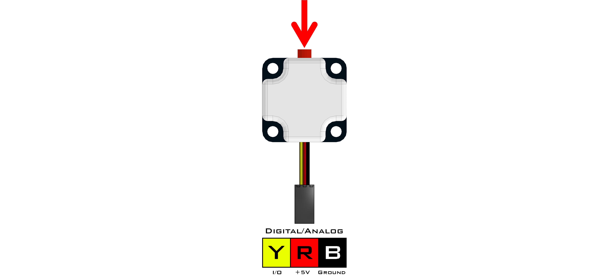

# **Touch Sensor (45-2007)**
-----
The Touch Sensor can be used for an array of different tasks including object detection, a counter, a standard push button and many more. The sensor can be attached to either an analog or digital port and contains a built-in LED which indicates when the sensor is activated. When the button is pressed, the value returned is 1. When the button is not pressed, the value returned is 0.

>**Sensor Type** : Three Wire Digital  
>**Dimensions** : 36mm x 32mm x 15mm  
>**Mounting Holes** : 24mm x 24mm  
>**Power** : 5V DC, 22mA Max  
>**Signal Logic Levels** : Logic 0 - 0V, Logic 1 - 5V  
>[Touch Sensor Visual Programming Blocks](Blk_Touch_Sensor.md)

**List of available functions:**  

* [**Fusion.digital(*driver*, *port*)**](Py_Touch_Sensor.md#fusiondigitaldriver-port)
* [**read()**](Py_Touch_Sensor.md#read)

## **Fusion.digital(*driver*, *port*)**
>### Definition
>>The following class provides a wrapper for the digital function to tie sensor names directly to the port and read all in one simple motion. 
>
>### Parameters
>>***driver*** : Main driver object so the class can call driver functions (**f**)  
>>***port*** : Digital port the sensor is connected to D0 - D7
>
>### Returns
>>**Digital Object**
>
>### Example
>>
    import Fusion
    f = Fusion.driver()
    touch_D7 = Fusion.digital(f, f.D7)
    
## **read()**
>### Definition
>>Returns the current digital value of the sensor.
>
>### Parameters
>>**None**
>
>### Returns
>>***Pressed*** : int (0 - 1)
>
>### Example
>>
    import Fusion
    f = Fusion.driver()
    touch_D7 = Fusion.digital(f, f.D7)
    print touch_D7.read()

## **Questions?**
>Contact Boxlight Robotics at [support@BoxlightRobotics.com](mailto:support@BoxlightRobotics.com) with a detailed description of the steps you have taken and observations you have made.
>
>**Email Subject**: Fusion Python Touch Sensor