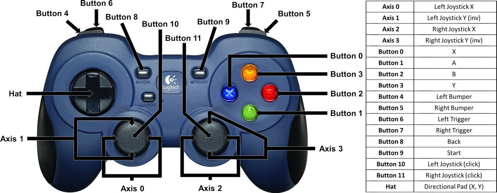
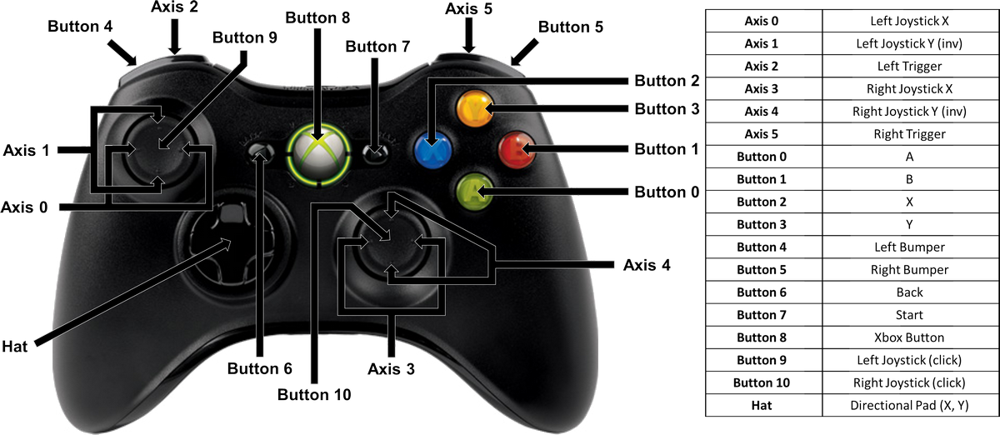

# **USB Gamepad**
-----
This library allows you to connect a wired or wireless USB gamepad to the Fusion for control.
  
>[USB Gamepad Visual Programming Blocks](Blk_usbGamepad.md)

>[**USB Gamepad Button Mapping**](Py_usbGamepad.md#usb-gamepads)

**List of available functions:**  

* [**Fusion.usbGamepad(*pad_num*)**](Py_usbGamepad.md#fusionusbgamepadpad_num)
* [**readAxis(*axis*, *inv*)**](Py_usbGamepad.md#readaxisaxis-inv)
* [**readAxisFloat(*axis*, *inv*)**](Py_usbGamepad.md#readaxisfloataxis-inv)
* [**mixer(*x_axis*, *y_axis*, *x_inv*, *y_inv*)**](Py_usbGamepad.md#mixerx_axis-y_axis-x_inv-y_inv)
* [**readButton(*button*)**](Py_usbGamepad.md#readbuttonbutton)
* [**readHat(*hat*)**](Py_usbGamepad.md#readhathat)

## **Fusion.usbGamepad(*pad_num*)**
>### Definition
>>This class contains the necessary drivers for the USB Gamepad and must be called at the beginning of the program before using any other class functions. The first USB Gamepad connected to the Fusion has a *pad_num* equal to 0. Every additional USB Gamepad connected after increases the *pad_num* by 1.
>
>### Parameters
>>***pad_num*** : Which USB Gamepad to connect to (Default 0)
>
>### Returns
>>**USB Gamepad Object**
>
>### Example
>>
    import Fusion
    # First Controller Connected (Default)
    usbg0 = Fusion.usbGamepad()
    # Second Controller Connected
    usbg1 = Fusion.usbGamepad(1)

## **readAxis(*axis*, *inv*)**
>### Definition
>>Read the selected axis from the USB Gamepad as an integer. The available number of axes is dependent on the USB Gamepad. Refer to the diagrams for availability. 
>
>
>
>### Parameters
>>***axis*** : The number for which axis you want to read from.  
>>***inv*** : Flip the positive/negative values of the axis.
>
>### Returns
>>***value*** : int (-100 - 100)
>
>### Example
>>
    import Fusion
    usbg = Fusion.usbGamepad()
    print usbg.readAxis(0)
    print usbg.readAxis(3)
    
## **readAxisFloat(*axis*, *inv*)**  
>### Definition
>>Read the selected axis from the USB Gamepad as a floating point number. The available number of axes is dependent on the USB Gamepad. Refer to the diagrams for availability. 
>
>### Parameters
>>***axis*** : The number for which axis you want to read from.  
>>***inv*** : Flip the positive/negative values of the axis.
>
>### Returns
>>***value*** : int (-1.00 - 1.00)
>
>### Example
>>
    import Fusion
    usbg = Fusion.usbGamepad()
    print usbg.readAxisFloat(0)
    print usbg.readAxisFloat(3)
    
## **mixer(*x_axis*, *y_axis*, *x_inv*, *y_inv*)**  
>### Definition
>>Combines 2 joystick values to create a proportional tank drive. The *X-Axis* is the joystick value for turning left or right. The *Y-Axis* is the joystick value for driving forward and backward. The *X-Invert* and *Y-Invert* can flip the value of a joystick between positive and negative. Therefore if the robot drives or turns in the opposite direction of the joystick, invert the appropriate axis.  
>Axis Mixer returns (M0, M1) where M0 and M1 range from -100 to 100.
>
>### Parameters
>>***x_axis*** : The number for which axis you want to read from for the X-Axis(turn).  
>>***y_axis*** : The number for which axis you want to read from for the Y-Axis(drive).    
>>***x_inv*** : Inverts the x_axis values. (Default **False**)  
>>***y_inv*** : Inverts the y_axis values. (Default **False**)  
>
>### Returns
>>***value*** : tuple (X, Y) where X/Y = -100 to 100
>
>### Example
>>
    import Fusion
    usbg = Fusion.usbGamepad()
    motorpower = usbg.mixer(0,1)
    print motorpower    # (-50,100)
    print motorpower[0] # -50
    print motorpower[1] # 100
    
>>or
    
>>
    import Fusion
    f = Fusion.driver()
    usbg = Fusion.usbGamepad()
    while True:
        (left, right) = usbg.mixer(0,1,False,True)
        f.motorSpeed(f.M0, right)
        f.motorSpeed(f.M1, left)

## **readButton(*button*)**  
>### Definition
>>Read the selected button from the USB Gamepad. The available number of buttons is dependent on the USB Gamepad. Refer to the diagrams for availability. 
>
>### Parameters
>>***button*** : The number for which button you want to read from.
>
>### Returns
>>***value*** : int (0 or 1)
>
>### Example
>>
    import Fusion
    usbg = Fusion.usbGamepad()
    print usbg.readButton(0)
    print usbg.readButton(3)    

## **readHat(*hat*)**  
>### Definition
>>Read the hat of the USB Gamepad. The hat may also be called the directional pad (D-pad). The hat can return a possibility of 9 possible combinations of values.
>
>
>
>### Parameters
>>***hat*** : The number for which hat you want to read from. Most USB Gamepads only have 1 physical hat, therefore this parameter can be left blank which will default to 0.
>
>### Returns
>>***value*** : tuple (X, Y) where X/Y = -1, 0, 1
>
>### Example
>>
    import Fusion
    usbg = Fusion.usbGamepad()
    hat = usbg.mixer(0,1)
    print hat       # (-1,1)
    print hat[0]    # -1
    print hat[1]    # 1

## **Questions?**
>Contact Boxlight Robotics at [support@BoxlightRobotics.com](mailto:support@BoxlightRobotics.com) with a detailed description of the steps you have taken and observations you have made.
>
>**Email Subject**: Fusion Python USB Gamepad
 
 
 
 
 
## **USB Gamepads**
-----
## **Logitech F310 Gamepad**

## **Xbox 360 Game Controller**
