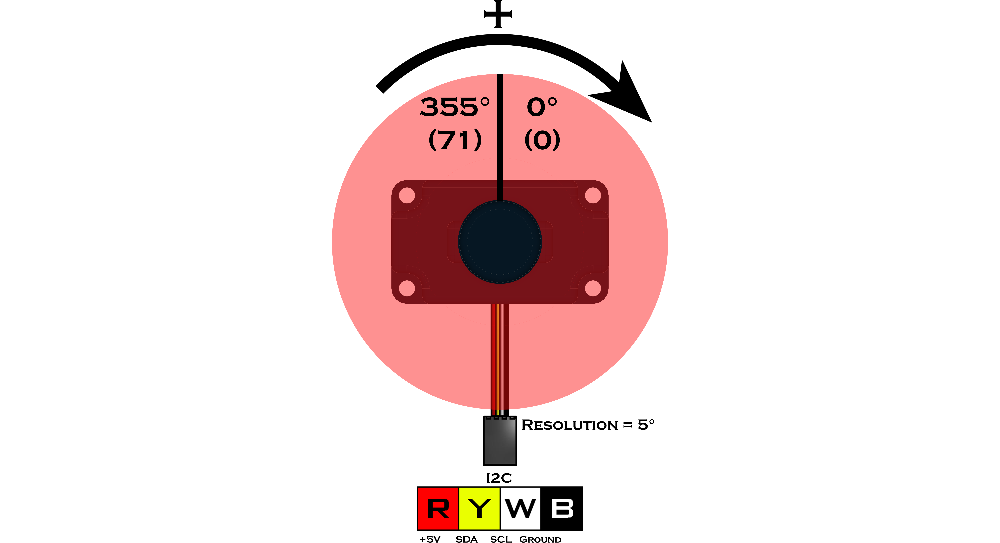

# **IR Locator 360° (45-2009)**
-----
The IR Locator 360° utilizes an array of 4 photodiodes to detect the direction and distance from a 1200Hz or 600Hz pulsed infrared source with a  5°resolution. Both the 600Hz and 1200Hz frequencies can be read at the same time allowing up to two directional sources to be used. This device is compatible with all legacy IR sources such as the HiTechnic IR Ball, Beacon, and Beacon V2. Overall detection range is based on the intensity of the IR source being used. 

>**Sensor Type** : Four Wire I2C  
>**Default I2C Address** : 0x1C  
>**Sensor ID Code** : 0x4C  
>**Dimensions** : 56mm x 32mm x 31mm  
>**Mounting Holes** : 48mm x 24mm  
>**Power** : 5V DC, 22mA Max  
>**Signal Logic Levels** : Logic 0 - 0V, Logic 1 - 5V  
>**I2C Bus Speed** : 100kHz max  
>**I2C Address Change Option** : Yes (Even Number 0x10 - 0xEE) 

>[IR Locator 360° Visual Programming Blocks](Blk_IR_Locator_360.md)  
>[IR Locator 360° Python Library Information](Py_IR_Locator_360.md)  

<table style="width:50%" align="center" border="2">
    <tr><th>
Register
</th><th>
Function
</th></tr>
    <tr><td>
0x00
</td><td>
Sensor Firmware Revision
</td></tr>
    <tr><td>
0x01
</td><td>
Manufacturer Code
</td></tr>
    <tr><td>
0x02
</td><td>
Sensor ID Code
</td></tr>
    <tr><td>
0x03
</td><td>
Not Used
</td></tr>
    <tr><td>
0x04
</td><td>
1200 Hz Heading in 5° increments
</td></tr>
    <tr><td>
0x05
</td><td>
1200 Hz Signal Strength
</td></tr>
    <tr><td>
0x06
</td><td>
600 Hz Heading in 5° increments
</td></tr>
    <tr><td>
0x07
</td><td>
600 Hz Signal Strength
</td></tr>
</table>

The frequencies are channels that the IR Locator 360 uses to tell the difference between IR emitting sources. Both 600Hz and 1200Hz IR signals may be present at the same time which results in two identifiable IR sources.

## **Heading**
>The heading value is returned in degrees and ranges from 0 to 71 at a resolution of 5°. If an object were to circle the sensor in a clockwise direction, the value of degrees will increase. If the object were to circle in a counter clockwise direction, the value of the heading will decrease.

## **Strength**
>The strength value represents the distance of the IR source out to a range of about 3m. When no IR source is detected the value of the strength approaches 0. As an IR source get closer to the sensor the value of the strength goes to 255.
