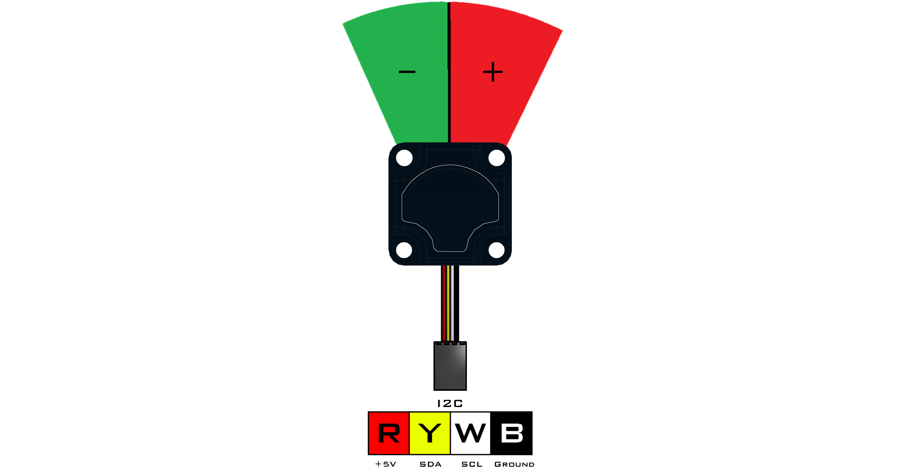

# **IR Seeker V3 (45-2017)**
-----
The IR Seeker V3 consists of 2 photodiodes to locate the direction and intensity of an IR source relative to the front of the sensor. The sensor can detect pulsed infrared light at 600Hz and 1200Hz with a 150° field of view. This device is compatible with all legacy IR sources such as the HiTechnic IR Ball, Beacon, and Beacon V2. Overall detection range is based on the intensity of the IR source being used. Overall detection range is based on the intensity of the IR source being used.

>**Sensor Type** : Four Wire I2C  
>**Default I2C Address** : 0x38  
>**Sensor ID Code** : 0x49  
>**Dimensions** : 32mm x 32mm x 19mm  
>**Mounting Holes** : 24mm x 24mm  
>**Power** : 5V DC, 22mA Max  
>**Signal Logic Levels** : Logic 0 - 0V, Logic 1 - 5V  
>**I2C Bus Speed** : 100kHz max  
>**I2C Address Change Option** : Yes (Even Number 0x10 - 0xEE)  

>[IR Seeker V3 Visual Programming Blocks](Blk_IR_Seeker_V3.md)  
>[IR Seeker V3 Python Library Information](Py_IR_Seeker_V3.md)  

<table style="width:50%" align="center" border="2">
    <tr><th>
Register
</th><th>
Function
</th></tr>
    <tr><td>
0x00
</td><td>
Sensor Firmware Revision
</td></tr>
    <tr><td>
0x01
</td><td>
Manufacturer Code
</td></tr>
    <tr><td>
0x02
</td><td>
Sensor ID Code
</td></tr>
    <tr><td>
0x03
</td><td>
Not Used
</td></tr>
    <tr><td>
0x04
</td><td>
1200 Hz Heading Data
</td></tr>
    <tr><td>
0x05
</td><td>
1200 Hz Signal Strength
</td></tr>
    <tr><td>
0x06
</td><td>
600 Hz Heading Data
</td></tr>
    <tr><td>
0x07
</td><td>
600 Hz Signal Strength
</td></tr>
    <tr><td>
0x08/0x09
</td><td>
1200 Hz Left Side Raw Heading Data (lsb/msb)
</td></tr>
    <tr><td>
0x0A/0x0B
</td><td>
1200 Hz Right Side Raw Heading Data (lsb/msb)
</td></tr>
    <tr><td>
0x0C/0x0D
</td><td>
600 Hz Left Side Raw Heading Data (lsb/msb)
</td></tr>
    <tr><td>
0x0E/0x0F
</td><td>
600 Hz Right Side Raw Heading Data (lsb/msb)
</td></tr>
</table>

The frequencies are channels that the IR Seeker V3 uses to tell the difference between IR emitting sources. Both 600Hz and 1200Hz IR signals may be present at the same time which results in two identifiable IR sources.

## **Heading**
>The heading value gives an indication of the source direction. If the value is negative, then the source is to the left of center. If the value is positive, then the source is to the right of center. The magnitude of the values gives an indication of how far off the axis the source is. If the value is zero, then the source is in the center of the field of view.

## **Strength**
>The strength value represents the magnitude of the receive signal. If this value is set to 0, it means that not enough IR signal is available to estimate the heading value. The value of the strength will increase as an IR source approaches the sensor.