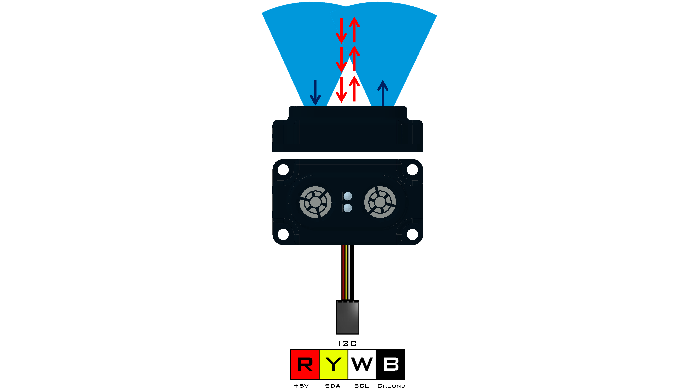

# **Range Sensor (45-2008)**
-----
The Range Sensor combines ultrasonic and optical measuring elements to obtain a reading between 1cm and 255cm. The ultrasonic accurately measures distance to a target up to 255cm away, but it losses accuracy if the object is closer than 5cm. This is where the optical sensor comes into play as it can measure from 1cm out to about 7cm. The target shape and surface material will influence the detectable range.

>**Sensor Type** : Four Wire I2C  
>**Default I2C Address** : 0x28  
>**Sensor ID Code** : 0x55  
>**Dimensions** : 56mm x 32mm x 17mm  
>**Mounting Holes** : 48mm x 24mm  
>**Power** : 5V DC, 22mA Max  
>**Signal Logic Levels** : Logic 0 - 0V, Logic 1 - 5V  
>**I2C Bus Speed** : 100kHz max  
>**I2C Address Change Option** : Yes (Even Number 0x10 - 0xEE)

>[Range Sensor Visual Programming Blocks](Blk_Range_Sensor.md)  
>[Range Sensor Python Library Information](Py_Range_Sensor.md)  

<table style="width:50%" align="center" border="2">
    <tr><th>
Register
</th><th>
Function
</th></tr>
    <tr><td>
0x00
</td><td>
Sensor Firmware Revision
</td></tr>
    <tr><td>
0x01
</td><td>
Manufacturer Code
</td></tr>
    <tr><td>
0x02
</td><td>
Sensor ID Code
</td></tr>
    <tr><td>
0x03
</td><td>
Not Used
</td></tr>
    <tr><td>
0x04
</td><td>
Ultrasonic reading (cm)
</td></tr>
    <tr><td>
0x05
</td><td>
Optical Reading
</td></tr>
</table>

## **Ultrasonic**
>The ultrasonic element works by one of the transducers emitting a sound wave and the other receiving the sound wave. This reading is accurate between 5cm and approximately 255cm. Since the value returned is in units of centimeters, the return is linear.

## **Optical**
>The optical element works by emitting infrared light from on LED and receiving infrared light to the other LED. The optical value can detect objects within 15cm. As an object approaches the optical element the returned value will increase at an exponential rate.