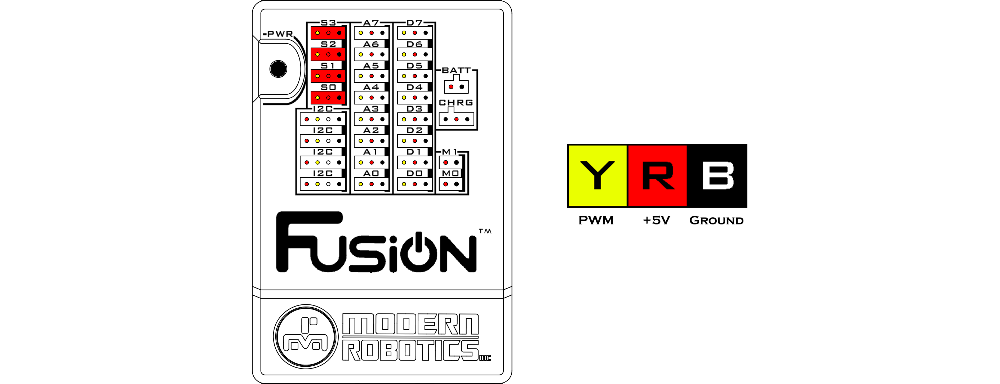

# **Servo Ports**
-----
There are 4 servo ports for controlling analog and digital servos. 

>**Power** : 6V DC  
>**Standard Mode** : 750uS – 2250uS  
>**Extended Mode** : 500uS – 2500uS  
>**Ports** : S0 - S3  
>[Blockly Programming Reference](Int_Servos.md)   
>[Python Programming Reference](Py_Servos.md)

Servos operate on Pulse Width Modulation (PWM) which allows for an analog result using a digital signal. This is achieved by timing how long the signal is **HIGH**, how long the signal is **LOW** and comparing them to get the duty cycle.

Servos use this signal to dictate which position to go to. A PWM value of 255 creates a 100% duty cycle while a value of 0 creates a 0% duty cycle. When a servo is turned on, it defaults to a value of 127 which is a 50% duty cycle and places the servo halfway through its mechanical limits.  

When reaching the limits of 0 or 255, listen to your servo for humming or clicking which would indicate that the servo has reach or is attempting to surpass its mechanical limit. Be careful as Boxlight Robotics is not responsible for damaged servos due to exceeding mechanical limits.

## **Questions?**
>Contact Boxlight Robotics at [support@BoxlightRobotics.com](mailto:support@BoxlightRobotics.com) with a detailed description of the steps you have taken and observations you have made.
>
>**Email Subject**: Fusion Servo Ports