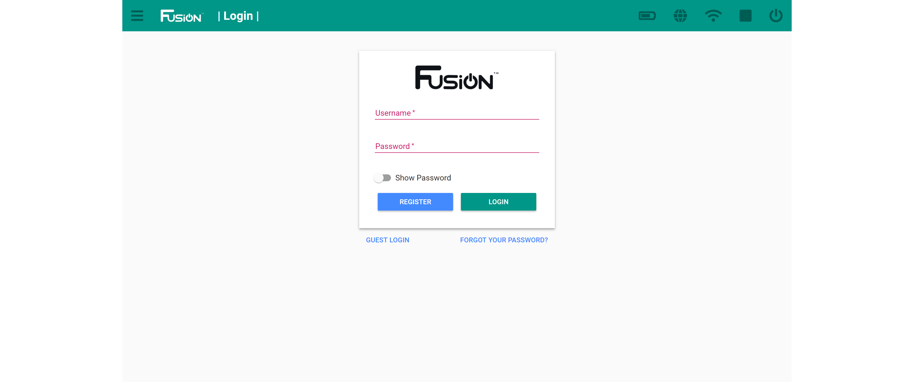

# **Update Fusion**
-----
##Update the Fusion
>You must be logged into an administrator account to update.

>**1.** Open the Fusion settings from the hamburger menu on the left or the settings box on the home page.

>**2.** Navigate to the **SOFTWARE** menu.

>**3.** If an update is available the button will be blue. Select the **UPDATE** button.  

>**4.** The update screen will start to fill with text. This is the update script running and producing output to the screen.

>**5.** The Fusion server will restart and you will be redirected to the log in screen.

Log in with your username and password to use your updated Fusion.

## **Questions?**
>Contact Boxlight Robotics at [support@BoxlightRobotics.com](mailto:support@BoxlightRobotics.com) with a detailed description of the steps you have taken and observations you have made.
>
>**Email Subject**: Updating Fusion